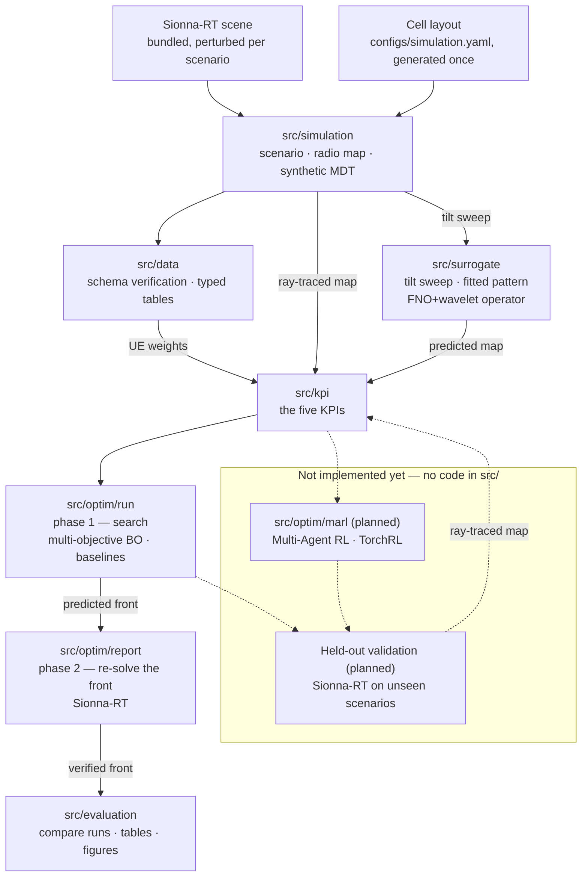

# MULTI-BAND TILT COORDINATION FOR COVERAGE EFFICIENT 5G/6G RAN

Research code comparing trust-region Bayesian Optimization (TuRBO) and
Multi-Agent Reinforcement Learning for multi-band antenna tilt coordination in
5G/6G radio access networks.

[](LICENSE)
[](pyproject.toml)
[](#status-and-ownership)

## Status and ownership

| | |
|---|---|
| **Maturity** | **Alpha** — simulation, preprocessing, the tilt-delta surrogate, the Bayesian-optimization arm and run reporting run end to end for one scenario; MARL and held-out validation have no code yet. |
| **Owner** | Nguyễn Duy Vũ |
| **Contact** | via [GitHub issues](https://github.com/NguyenVu04/band-tilt/issues) |
| **Source of record** | <https://github.com/NguyenVu04/band-tilt> |
| **Issue tracker** | <https://github.com/NguyenVu04/band-tilt/issues> |
| **Description of record** | this README, plus [CLAUDE.md](CLAUDE.md) |
| **Decisions** | [docs/adr/](docs/adr/) |

## Contents

- [Overview](#overview)
- [Architecture](#architecture)
- [Getting started](#getting-started)
- [Configuration](#configuration)
- [Usage](#usage)
- [Development](#development)
- [Testing](#testing)
- [Compliance and data handling](#compliance-and-data-handling)
- [Versioning and reproducibility](#versioning-and-reproducibility)
- [Governance](#governance)
- [Roadmap](#roadmap)

## Overview

Antenna downtilt is the cheapest lever a mobile operator has for shaping
coverage, and it is largely set by hand. Tilt a cell down and its footprint
shrinks: interference with neighbours falls, and coverage holes open at the cell
edge. Tilt it up and the reverse happens. With several frequency bands per node
the problem compounds — bands have different propagation characteristics, so they
should not cover the same footprint, and deciding which band should dominate
where is a coordination problem across dozens of coupled variables.

This project formulates that as a constrained optimization over **absolute tilt**
for every `(cell, band)` pair, evaluated against five KPIs computed from
Sionna-RT ray-traced radio maps, and compares two solution methods — **TuRBO**
(trust-region Bayesian Optimization) and **Multi-Agent RL** — under one identical
problem definition.

Everything is simulated end to end. `src/simulation/` perturbs a Sionna-RT scene
(buildings removed, resized, nudged — modelling survey error), draws a
time-varying UE population over it, ray-traces one clean radio map per band, and
samples that map at the UEs with receiver noise and realistic censoring to
produce the synthetic MDT. Because a scenario is defined by its seed and is
therefore *regenerated*, not recorded, it can also be perturbed on purpose —
which is how the project will ask whether an optimized configuration survives
conditions it was not tuned for, once the optimization side exists.

The KPI mathematics lives in [`src/kpi/`](src/kpi/) and nowhere else; the
thresholds and weights it reads are in [`configs/kpi.yaml`](configs/kpi.yaml),
and the reasoning behind the choice of KPIs is in
[ADR 0001](docs/adr/0001-five-kpis-under-lexicographic-priority.md).

### Capabilities

- **A single, testable objective.** Five KPIs — hole rate, overlap rate, a
  UE-weighted band priority score, expected RSRP improvement, and weak rate —
  defined once in `src/kpi/`, in that lexicographic priority order. Three read a
  plain RSRP array and nothing else; the two UE-weighted ones also read the
  synthetic MDT. Either way the objective is testable against hand-computed
  fixtures with no simulator involved.
- **A shared search space.** TuRBO and MARL derive their bounds from the same
  module and score through the same functions, so the comparison measures the two
  methods rather than two implementations. TuRBO's trust region is a subset of
  that space, never a relaxation of it.
- **A radio-map surrogate, and a report that does not trust it.** Ray tracing
  is too slow to sit inside a search loop, so `src/surrogate/` predicts the RSRP
  map after a tilt change from the map before it. It satisfies the same
  `ObjectiveEvaluator` protocol the ray tracer does, so a search cannot tell
  which one it holds. Nothing it predicts is ever published: `src/optim/report.py`
  re-solves the front it proposed with Sionna-RT, re-derives the front from what
  was measured, and records the model's error on exactly the solutions it
  offered.
- **A front to choose from, not a winner.** Five objectives do not have a best.
  ADR 0001's priority order still runs and marks one row `recommended`, but the
  deliverable is the measured Pareto front — `pareto_<method>.csv` beside
  `tilt_options_<method>.csv` — so which trade-off to deploy stays a judgement
  a person makes.
- **Scenario-level evaluation (blocked on more scenarios).** Train, validation
  and test are meant to split between whole scenarios, so the held-out numbers
  measure transfer to unseen environments rather than interpolation within one.
  Only one scenario is on disk today, so this split cannot be made yet.
- **Band-generic throughout.** Nothing hardcodes the number of bands. Adding one
  is an edit to `configs/simulation.yaml`'s `radio_map.bands` and
  `transmitters.cells[*].tilt`.

### Non-goals

- **Minimising reconfiguration effort.** `delta_tilt` is derived after
  optimization for reporting only; there is no penalty on how far an antenna
  moves. The research question is which configuration is best, not how to get
  there cheaply.
- **Accessibility, throughput, and interference KPIs.** Excluded from the
  formulation. The available data supports neither — MDT carries RSRP and
  position, not connection outcomes, and modelling throughput would need load and
  scheduler assumptions that would dominate the result
  ([ADR 0001](docs/adr/0001-five-kpis-under-lexicographic-priority.md)).
- **Validation against a live network.** Robustness is studied by perturbing
  simulated scenarios, not by comparing against measurements from a real network.
  Every number this project produces comes from simulation, and no part of the
  chain is calibrated against reality.
- **Deployment to a live network.** There is no OSS/northbound integration and
  none is planned. The output is a tilt table, not a configuration push.

## Architecture



Solid arrows are implemented and run today; dashed arrows are the intended
design, not yet built. `src/kpi/` sits downstream of the simulator and of the
surrogate alike, so a predicted score and a measured one are computed by the
same functions and stay comparable. `src/evaluation/` reads run
directories off disk and re-solves nothing, which is what lets a comparison run
on a machine with no GPU.

### Components

| Component | Responsibility | Location |
|---|---|---|
| Core | The `Cell` / per-band `Tilt` data model shared by every other module | [`src/core/`](src/core/) |
| Simulation | Scene perturbation, UE population, radio-map ray tracing, synthetic MDT | [`src/simulation/`](src/simulation/) |
| Data | Load the simulation output, verify it against its contract, write typed processed tables | [`src/data/`](src/data/) |
| KPI | The five KPI definitions and the reductions they share | [`src/kpi/`](src/kpi/) |
| Utils | Config loading, seeding, plotting helpers shared by every notebook | [`src/utils/`](src/utils/) |
| Surrogate | Predicts the radio map after a tilt change, so the search needs no ray tracing | [`src/surrogate/`](src/surrogate/) |
| Optimization | The shared search space, the KPI vector and its priority rule, both evaluators, three searches, and the two-phase run and report | [`src/optim/`](src/optim/) |
| Evaluation | Load finished runs, compare methods, write tables and figures to `reports/`. Re-solves nothing — the Sionna-RT held-out validation is still missing | [`src/evaluation/`](src/evaluation/) |
| Notebooks | The pipeline, one notebook per phase | [`notebooks/`](notebooks/) |
| Configuration | Every tunable, in Hydra groups | [`configs/`](configs/) |

`app/` (FastAPI + Streamlit serving) is unrelated template scaffolding left over
from the project's starting point — see
[Implementation status](#implementation-status).

### External dependencies

| Dependency | Purpose | Criticality | Notes |
|---|---|---|---|
| [Sionna-RT](https://nvlabs.github.io/sionna/) | The bundled scene, and ray-traced radio maps every downstream artifact derives from | **Critical** | `--extra rt`; needs a CUDA GPU to be practical |
| Cell layout and tilt bounds | Band, carrier, power and per-band tilt bounds per cell | Resolved | Generated once by `task simulation:layout` and committed in [`configs/simulation.yaml`](configs/simulation.yaml) — no external data needed |
| [Ax](https://ax.dev/) + [BoTorch](https://botorch.org/) | The GP model and hypervolume acquisition the BO arm runs on | In use | `--extra bo`; read by [`src/optim/methods/mobo/search.py`](src/optim/methods/mobo/search.py) and by `objective.hypervolume` |
| [TorchRL](https://pytorch.org/rl/) | The MARL environment, policy and trainer | Not yet used | `--extra marl`; no MARL code exists yet |
| [DVC](https://dvc.org/) | Data and artifact versioning | Optional | `--extra dvc`; see [`dvc.yaml`](dvc.yaml). **Not yet initialised in this repository** — there is no `.dvc/` directory or remote configured; `data/` is presently just gitignored |
| [MLflow](https://mlflow.org/) | Experiment tracking | Optional | `--extra tracking`; imported lazily; not yet called from the active pipeline |

## Getting started

### Prerequisites

| Requirement | Version | Notes |
|---|---|---|
| Python | `>=3.11,<3.14` | capped: hydra-core 1.3.x cannot build its argparse parser on 3.14 |
| [uv](https://docs.astral.sh/uv/) | 0.9+ | the only supported installer; `uv.lock` is committed |
| [Task](https://taskfile.dev/) | 3.x | the task runner; every command below assumes it |
| CUDA GPU | — | needed for `task simulation:radio` and `task simulation:mdt`; Sionna-RT ray tracing is impractically slow without one |
| Sionna-RT scene | — | bundled with the `rt` extra (`task sync:rt`); nothing supplied externally |

### Install

```bash
git clone https://github.com/NguyenVu04/band-tilt.git
cd band-tilt
task setup
```

`task setup` installs every extra and the pre-commit hooks. For data work alone,
`task sync` installs the base and dev environment without Sionna-RT, Ax/BoTorch
or TorchRL — a much smaller download.

### Configure

```bash
cp .env.example .env
# Fill in the required values — see Configuration below.
```

`.env` holds only environment-specific settings. Anything that affects a result
lives in `configs/`, so that Git history records what produced it.

### Verify

```bash
task check
```

Expected output:

```
uv run ruff check .
All checks passed!
uv run ruff format --check .
uv run pytest
179 passed
```

`tests/` covers `src/simulation/`'s density, region and traffic logic, the five
KPIs, and `src/optim/` and `src/evaluation/` — the parts most worth pinning down
by hand-computed fixtures. It does not yet cover `src/data/` or `src/core/`; see
[Implementation status](#implementation-status).

To confirm the active package tree is intact:

```bash
uv run python -c "import src.simulation, src.data, src.kpi, src.optim, src.evaluation, src.core, src.utils"
```

This must succeed silently.

## Configuration

Results-affecting settings live in [`configs/`](configs/) as Hydra groups,
composed by `src.config.load_config` into one `cfg` with `cfg.simulation`,
`cfg.kpi` and `cfg.data`, per [`configs/config.yaml`](configs/config.yaml)'s
`defaults` list.

| Group | File | Holds |
|---|---|---|
| `simulation` | [`configs/simulation.yaml`](configs/simulation.yaml) | scene, grid, UE population, perturbation, materials, the cell layout and tilt bounds, radio-map solver settings, MDT noise/censoring, output paths |
| `kpi` | [`configs/kpi.yaml`](configs/kpi.yaml) | KPI thresholds, Band Priority Score weights, the improvement sigmoid's sensitivity, and the per-KPI tie tolerances. The priority *order* is not here — it is `KPI_NAMES` in [`src/optim/objective.py`](src/optim/objective.py) |
| `data` | [`configs/data.yaml`](configs/data.yaml) | output paths for the two processed tables |

[`configs/optim/base.yaml`](configs/optim/base.yaml) configures what every
optimization run shares — the output directories and the seed — and the
`optim/method` group ([`configs/optim/method/`](configs/optim/method)) holds one
file per method with that method's own budget or sweep settings. Select one with
`optim/method=rule`; note the slash, it is a config group and not a key.

Override from the command line, e.g. `task simulation:radio -- seed=7`.

Environment variables, from `.env.example`:

| Name | Type | Default | Required | Secret | Description |
|---|---|---|---|---|---|
| `MLFLOW_TRACKING_URI` | string | `./mlruns` | no | no | Where experiment runs are recorded |
| `DVC_REMOTE_URL` | string | — | no | **yes** | Remote for `dvc push` / `dvc pull`; may embed credentials |
| `DATA_ROOT` | string | `./data` | no | no | Override when the dataset lives outside the repository |

Precedence: command-line Hydra overrides > environment variables > `configs/`
defaults.

`.env` is gitignored and there is no secret manager — this is a research
repository, and `DVC_REMOTE_URL` is the only value that may carry a credential.

## Usage

The implemented part of the pipeline runs as a chain of notebooks, or as scripts
through the task runner and `dvc repro`. Both call the same functions in
`src/`, so they cannot diverge.

| Phase | Notebook | Script |
|---|---|---|
| 1 — Generate the scenario, radio maps and synthetic MDT | [`00_simulation`](notebooks/00_simulation.ipynb) | `task simulation` (`simulation:scenario` → `simulation:radio` → `simulation:mdt`) |
| 2 — Explore the simulation output; specify notebook 02 | [`01_eda`](notebooks/01_eda.ipynb) | — (read-only, writes no artifacts) |
| 3 — Verify and type the processed tables | [`02_preprocessing`](notebooks/02_preprocessing.ipynb) | `python -m src.data.build` |
| 4 — Sweep the tilt range and fit the antenna pattern | [`03a_surrogate_data`](notebooks/03a_surrogate_data.ipynb) | `task surrogate:dataset` |
| 5 — Train and score the tilt-delta surrogate | [`03b_surrogate_model`](notebooks/03b_surrogate_model.ipynb) | `task surrogate:train` |
| 6 — Search with the baselines (phase 1) | [`04a_baseline`](notebooks/04a_baseline.ipynb) | `task baseline` (add `-- optim/method=rule` for the rule-based search) |
| 7 — Search with multi-objective Bayesian Optimization (phase 1) | [`04b_mobo`](notebooks/04b_mobo.ipynb) | `task bo` |
| 8 — Re-solve the searched front with Sionna-RT (phase 2) | — (both notebooks call it at the end) | `task optim:report` |
| 9 — Compare the runs, write the tables and figures | [`05_evaluation`](notebooks/05_evaluation.ipynb) | — (reads run directories; writes to `reports/`) |

```bash
task lab                # start JupyterLab
task simulation         # the three simulation stages, in order
task surrogate:dataset  # sweep the tilt range (GPU), then
task surrogate:train    # fit the operator the search scores with
task optim              # both phases: task bo, then task optim:report
task dvc:repro          # the pipeline through DVC, skipping what's unchanged
```

### The two optimization phases

Ray tracing one tilt configuration costs 30–40 s, so searching with it costs
hours. The search and the measurement are therefore split, and only the second
half needs a GPU.

**Phase 1, `task bo`.** Scores every candidate with the surrogate and writes
`outputs/optim/<method>/<timestamp>/` — the per-candidate history, the predicted
Pareto subset, and a `run.json` marked `verified: false`. There is no winner and
no deliverable, because nothing here has been measured. `src/evaluation` refuses
to load such a run rather than let a prediction be read as a result.

**Phase 2, `task optim:report`.** Re-solves that run's front with Sionna-RT —
`optim.report.n_solutions` of them, 8 by default, always including the incumbent
— re-derives the Pareto front from what it measured, and completes the run
directory with `best_tilt.parquet`, `best_radio_map.npz` and
`pareto_verified.parquet`. The last of those records the surrogate's error on
exactly the solutions it recommended, so every run reports how far the model was
off rather than assuming the training numbers still hold.

Which solutions get re-solved is not the priority order: that would return eight
neighbours from one corner of the front. They are ranked by NSGA-II crowding
distance, which keeps the extremes and spreads the rest.

**The deliverable is the front.** `reports/outputs/` gets
`pareto_<method>.csv` — one row per measured Pareto solution, its five KPIs and
each one's delta against the incumbent — and `tilt_options_<method>.csv`, the
tilt table each of those becomes. ADR 0001's priority order marks one row
`recommended` and `tilt_change_<method>.csv` carries it, but choosing among
measured trade-offs is left to a person. The MARL arm is not built, so a
comparison currently has BO and the two baselines in it and nothing else.

Three Taskfile entries are dead, calling modules that do not exist:
`task clean:data` (`src.data.clean`), `task marl` (`src.optim.marl.train`),
`task validate` (`src.evaluation.validate`). See
[Implementation status](#implementation-status).

Each notebook opens in Colab from the badge in its first cell; the bootstrap
cell clones the repository and installs what Colab does not ship.

## Development

### Layout

```
band-tilt/
├── configs/       Hydra config groups — every tunable
├── data/          gitignored; scenario, radio map and MDT artifacts (DVC not yet initialised — see External dependencies)
├── docs/adr/      architecture decision records
├── notebooks/     one per pipeline phase, 00 through 05
├── outputs/       gitignored; one directory per optimization run
├── reports/       tables, figures and the republished tilt deliverable
├── src/           importable project logic
├── tests/         unit tests for simulation, the KPIs, optim and evaluation
├── app/           template serving scaffolding — see Implementation status
└── Taskfile.yml   every command
```

### Implementation status

| Area | State |
|---|---|
| `src/core/` — the `Cell` / `Tilt` data model | Implemented |
| `src/simulation/` — scenario, scene, perturbation, materials, transmitters, radio map, MDT | Implemented; runs end to end for one scenario (`task simulation`) |
| `src/data/` — load, schema verification, processed-table build | Implemented (`python -m src.data.build`) |
| `src/kpi/` — the five KPIs (`hole`, `overlap`, `improvement`, `bps`, `weak`), with `serving.py` and `tiles.py` | Implemented and unit-tested (`tests/test_kpi.py`); scored on every evaluation by `src/optim/evaluator.py` and read by `src/evaluation/maps.py` |
| `src/utils/` — config loading, seeding, plotting | Implemented |
| `notebooks/` — `00_simulation` through `05_evaluation` | All eight written and adapted to this project |
| `src/optim/` | Implemented and unit-tested: the tilt space, the KPI vector, the Sionna-RT evaluator, Ax multi-objective BO, random-search and rule-based baselines, and the two phases — `run.py` searches with the surrogate, `report.py` re-solves the front |
| `src/evaluation/` | Implemented and unit-tested: loading runs, coverage and demand rasters, comparison tables, figures, export to `reports/`. Reads artifacts only — it never re-solves |
| `src/surrogate/` | Implemented and unit-tested: scene channels, the tilt sweep, the fitted antenna pattern, the FNO + wavelet operator, training, and a `SurrogateEvaluator` that satisfies the same `ObjectiveEvaluator` protocol the ray tracer does |
| `src/optim/marl/` | Does not exist |
| `app/` (FastAPI + Streamlit) | Untouched template scaffolding. Out of scope; `app/api/dependencies.py` still refers to `cfg.models.artifact_path`, which does not compose against `configs/config.yaml` |
| CI | None. `task lint` and `task test` run locally only. |

#### Known gaps in the active pipeline

| Gap | Consequence |
|---|---|
| Only one scenario is on disk | The intended between-scenario train/validation/test split cannot be made yet — see `01_eda.ipynb` section 11. Every optimized configuration is therefore tuned and scored on the same world |
| `kpi.tolerance.expected_rsrp_improvement` is unmeasured | It is a placeholder, flagged as such in [`configs/kpi.yaml`](configs/kpi.yaml). The other four tolerances sit at the ray tracer's run-to-run spread under a changed solver seed; this one has not been measured that way, so the **fourth** priority slot's tie behaviour is unverified. It moved down from third on 2026-09-09, which narrows the gap's reach without closing it |
| No held-out re-evaluation | `src/evaluation/` compares runs already on disk. Nothing re-solves an optimized tilt on an unseen scenario, so no number here measures transfer |
| `task clean:data` calls `src.data.clean`, which does not exist | Dead task; the legacy operator-export cleaning it used to run is retired, see [Compliance and data handling](#compliance-and-data-handling) |
| `task marl`, `task validate` | Dead tasks — they call `src.optim.marl.train` and `src.evaluation.validate`, neither of which exists |
| A fully ray-traced search is no longer reachable | `task bo` always searches with the surrogate. Reproducing a pre-2026-09-09 run means reverting the code; see the revision note in [ADR 0002](docs/adr/0002-bayesian-optimization-without-a-trust-region.md) |

### Standards

| | |
|---|---|
| **Style and lint** | `ruff` with `E`, `F`, `I`, `UP`, `B`, `D` (Google docstrings), enforced by pre-commit and `task lint` |
| **Commits** | [Conventional Commits](https://www.conventionalcommits.org/) |
| **Branching** | short-lived branches off `main` |
| **Review** | self-review before merge — see [Governance](#governance) |

### Local loop

```bash
task format
task check
```

## Testing

| Tier | Scope | Command | Where it runs |
|---|---|---|---|
| Unit | `src/simulation/`'s density, region and traffic logic; the five KPIs; `src/optim/`'s space, objective, searches and report phase; `src/surrogate/`'s operator and dataset; `src/evaluation/` — all against synthetic fixtures | `task test` | pre-commit, locally |
| Single test | One behaviour | `uv run pytest tests/test_kpi.py -k <name>` | locally |

**There is no coverage gate and no CI.** `tests/` currently covers
`src/simulation/`'s `density.py`, `sample.py` (region) and `traffic.py`,
`src/kpi/`, `src/optim/`, `src/surrogate/` and `src/evaluation/` — 179 tests,
all passing, none skipped. `src/data/` and `src/core/` have no tests yet.

The one rule the tests hold to: **no test touches Sionna-RT, a GPU, or a real
dataset.** Fixtures are tiny and synthetic, so `task test` runs the same way in
CI as on a laptop with no GPU — once CI exists.

## Compliance and data handling

**MDT is synthetic.** Both the UE positions and their RSRP are generated by
`src/simulation/` — the UE population from a time-varying density model over the
scene, the RSRP by Sionna-RT ray tracing against that same scene. No `ue_id`
corresponds to a person, no position was observed, and nothing in the pipeline
is personal data. There is no DPIA to write and no lawful basis to establish,
because there is no data subject.

| | |
|---|---|
| **Data categories** | Simulated UE position in the scene's local frame, simulation timestamp, tile index, cell-band, simulated RSRP |
| **Provenance** | Generated from a bundled Sionna-RT scene, a synthetic UE-density model and per-cell tilt configuration. Regenerable from the scenario manifest (`data/external/scenario.json`) and the seed. |
| **Personal data** | None |
| **Retention** | Governed by storage cost, not by law. Meant to live in DVC for the life of the project; DVC is not yet initialised, so today the only copy is each contributor's local `data/`. |
| **Residency** | Wherever the DVC remote ends up configured; none exists yet. |

### The retired operator export

An earlier formulation used a real MDT export — 41,481 measurements from 1,490
devices over roughly two weeks. That file **did** contain device-level location
traces: a pseudonymous identifier, coordinates and a timestamp per measurement,
and sequences of those points describe where a device went and when. Trajectory
data is notoriously re-identifiable, so it was personal data under most regimes
despite carrying no name, MSISDN or IMSI.

It is no longer an input to this project — `data/` in this repository carries no
`raw/` directory and `dvc.yaml` no longer defines a stage that reads one. There
is also no DVC remote configured in this repository (see
[External dependencies](#external-dependencies)), so there is nowhere here a
copy of `measurement_data.csv` could persist; if one exists it is on someone's
disk or in a remote from before this formulation, not tracked by anything here.

> [!WARNING]
> **Do not reintroduce the operator export as a project input** without first
> settling what the earlier version of this section called for and never
> obtained: the lawful basis for research use, whether the pseudonymisation is
> sufficient given the trajectory structure, a retention period, and whether raw
> coordinates may appear in published figures. None of that was ever assessed.
> Deleting it from the DVC remote is the cleaner option if nothing depends on it.

The repository never commits data: `data/` is gitignored (meant to become
DVC-tracked once DVC is initialised), `.env` is gitignored, and no identifier
appears in any committed file.

## Versioning and reproducibility

This project follows [Semantic Versioning](https://semver.org/spec/v2.0.0.html).

**The public API is** the `src/` module and function signatures, and the
`configs/` schema. Everything else — notebook internals, `app/`, the contents of
`reports/` — may change in any release. While the project is Alpha, signatures
change without a major version bump; the ADRs record the changes that matter.

### Artifact lineage

Code alone does not reproduce a result that depends on data, on a random seed,
and on a ray-tracing configuration.

| Layer | Versioned by | Answers |
|---|---|---|
| Code and configuration | Git, plus the Hydra config saved beside each run in `outputs/hydra/` | By what procedure was this produced? |
| Data and artifacts | DVC (`.dvc` files committed, contents in the remote) — **not yet set up**; `task dvc:init` has not been run in this repository | Which exact inputs and outputs? |
| Runs and results | MLflow (`./mlruns` by default) | What happened, and how did it score? |
| Simulation fidelity | `cfg.simulation.radio_map` and `cfg.simulation.grid`, recorded in the radio map's own `.npz` metadata | Against what ground truth? |
| Which evaluator measured a KPI | The `source` column of `history.parquet`, and `verified` in `run.json` | Is this row a prediction or a measurement? |
| Scenario | `scenario_id` and its manifest (`data/external/scenario.json`) — scene perturbation, density, time schedule, seed | Which world was this measured in? |

Restore a past result today: check out the commit, then `task dvc:repro` to
regenerate `data/` locally (there is no remote yet to `dvc pull` from).

Three things invalidate stored results rather than adding to them, because they
change the ground truth itself: the ray-tracing settings, the grid resolution,
and the KPI thresholds or their order. `dvc.yaml` expresses the first two as
parameter dependencies on the `simulation_radio` stage so a change forces a
rebuild; the third needs an ADR (see [ADR 0001](docs/adr/0001-five-kpis-under-lexicographic-priority.md)
for the existing one).

Artifact retention follows the DVC remote's policy; none is configured yet.

## Governance

| | |
|---|---|
| **Maintainer** | Nguyễn Duy Vũ — sole maintainer; there is no `CODEOWNERS` file |
| **Review requirement** | Self-review before merge; one approval once there is a second contributor |
| **Merge policy** | Squash onto `main`, linear history, `task check` green |
| **Decision records** | [`docs/adr/`](docs/adr/) |

Architecturally significant changes need an ADR **before** implementation. A
change to the KPI definitions, the decision variable, the angle convention, the
split scheme, or what a reported result may be computed from is always
significant — see [docs/adr/README.md](docs/adr/README.md).

## Roadmap

Ordered roughly by what unblocks the most.

| Item | Blocked on | Status |
|---|---|---|
| Run `task dvc:init` and configure a remote | — | Not started; `data/` is presently gitignored only |
| Run `task simulation` for several seeds, so a between-scenario split exists | — | **Blocking most of the below** |
| Measure `kpi.tolerance.expected_rsrp_improvement` — re-solve the baseline tilt under several solver seeds and take the spread | — | Not started; the value in `configs/kpi.yaml` is a flagged placeholder |
| Implement scenario-level train/validation/test splitting | multiple scenarios (above) | Not started |
| Delete or replace the dead tasks: `clean:data`, `marl`, `validate` | — | Not started |
| ~~Put the surrogate in the search loop, and re-solve only the front~~ | — | Done, as two phases with a verified front ([ADR 0002](docs/adr/0002-bayesian-optimization-without-a-trust-region.md), revision note) |
| Measure `optim.report.n_solutions` against how often the surrogate's ranking is wrong | several runs' `pareto_verified.parquet` | Not started; 8 is a judgement, and every run now records the evidence to revise it |
| Train the surrogate across scenarios, so it transfers to geometry it has not seen | the split (above) | Not started — the operator in `src/surrogate/` is deliberately fitted to one scene |
| ~~Implement the BO arm against `configs/optim/`~~ | — | Done, as multi-objective BO without a trust region ([ADR 0002](docs/adr/0002-bayesian-optimization-without-a-trust-region.md)) |
| ~~Implement `src/evaluation/` — load runs, compare methods, report~~ | — | Done for runs already on disk |
| Implement `src/optim/marl/` (Multi-Agent RL) over the same search space | — | Not started |
| Add held-out validation — re-solve optimized tilts with Sionna-RT on unseen scenarios | the split (above), and MARL results | Not started; `task validate` already points at the module that would do it |
| Decide the fate of `app/` (finish it as a serving layer, or remove the template scaffolding) | — | Not started |
| CI (`task check` on every push) | — | Not started |

## License

MIT — see [LICENSE](LICENSE).
