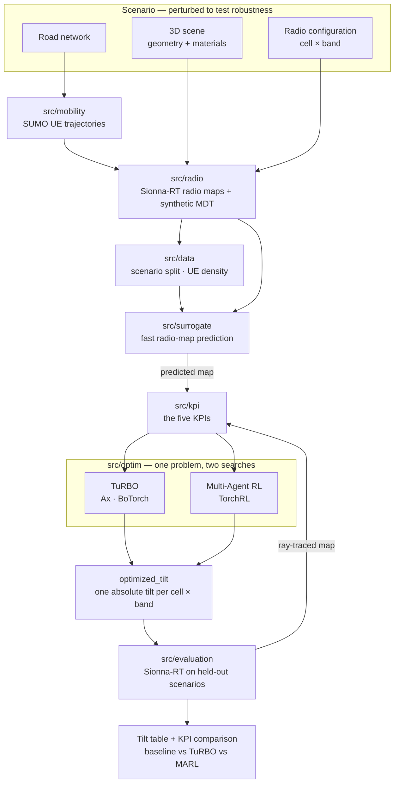

# band-tilt

Research code comparing trust-region Bayesian Optimization (TuRBO) and
Multi-Agent Reinforcement Learning for multi-band antenna tilt coordination in
5G/6G radio access networks.

[](LICENSE)
[](pyproject.toml)
[](#status-and-ownership)

## Status and ownership

| | |
|---|---|
| **Maturity** | **Alpha** — contract-first. Interfaces, configs and decision records are in place; almost every function body is still unimplemented. |
| **Owner** | Nguyễn Duy Vũ |
| **Contact** | via [GitHub issues](https://github.com/NguyenVu04/band-tilt/issues) |
| **Source of record** | <https://github.com/NguyenVu04/band-tilt> |
| **Issue tracker** | <https://github.com/NguyenVu04/band-tilt/issues> |
| **Specification** | [PROJECT.md](PROJECT.md) |
| **Decisions** | [docs/adr/](docs/adr/) |

> [!IMPORTANT]
> **This repository does not yet run end to end.** Three things stand in the way,
> all deliberate and all documented:
>
> 1. **The multi-band cell configuration has not arrived.** The available export
>    has no band, carrier frequency, transmit power, or electrical/mechanical tilt
>    split — so the central quantity, one tilt per `(cell, band)` pair, cannot be
>    formed from real data.
> 2. **UE mobility generation is unbuilt.** The specification generates UE
>    trajectories with SUMO and derives synthetic MDT from them; there is no
>    `src/mobility/` package, no SUMO dependency and no configuration for it.
> 3. **The code is contract-first.** Function bodies raise `NotImplementedError`
>    with their own dotted path; the docstrings, configs, tests and decision
>    records were written first so the shape of the problem is settled before any
>    implementation. See [Implementation status](#implementation-status).
>
> [PROJECT.md](PROJECT.md) was **rewritten on 2026-08-28**. The documentation,
> configuration and notebooks in this repository follow the new specification;
> parts of `src/` still implement the old one, and every such divergence is listed
> under Implementation status.
>
> This is not an operated service and has no on-call rotation.

## Contents

- [Overview](#overview)
- [Architecture](#architecture)
- [Getting started](#getting-started)
- [Configuration](#configuration)
- [Usage](#usage)
- [Development](#development)
- [Testing](#testing)
- [Compliance and data handling](#compliance-and-data-handling)
- [Versioning and reproducibility](#versioning-and-reproducibility)
- [Governance](#governance)
- [Roadmap](#roadmap)

## Overview

Antenna downtilt is the cheapest lever a mobile operator has for shaping
coverage, and it is largely set by hand. Tilt a cell down and its footprint
shrinks: interference with neighbours falls, and coverage holes open at the cell
edge. Tilt it up and the reverse happens. With several frequency bands per site
the problem compounds — bands have different propagation characteristics, so they
should not cover the same footprint, and deciding which band should dominate
where is a coordination problem across dozens of coupled variables.

This project formulates that as a constrained optimization over **absolute tilt**
for every `(cell, band)` pair, evaluated against five KPIs computed from
Sionna-RT ray-traced radio maps, and compares two solution methods — **TuRBO**
(trust-region Bayesian Optimization) and **Multi-Agent RL** — under one identical
problem definition.

Everything is simulated end to end. SUMO drives UE mobility over the road
network, Sionna-RT propagates through the 3D scene, and the two together produce
both the radio maps and the synthetic MDT that stands in for network
measurements. Because a scenario can therefore be *regenerated*, it can also be
perturbed — buildings moved, materials changed, traffic rerouted — which is how
the project asks whether an optimized configuration survives conditions it was
not tuned for.

The full formulation, including the KPI mathematics, is in
[PROJECT.md](PROJECT.md).

### Capabilities

- **A single, testable objective.** Five KPIs — hole rate, overlap rate, mean
  overlap neighbours, a UE-weighted band priority score, and weak rate — defined
  once in `src/kpi/`, in that lexicographic priority order. They consume a plain
  RSRP array, so the whole objective is testable against hand-computed fixtures
  with no simulator involved.
- **A shared search space.** TuRBO and MARL derive their bounds from the same
  module and score through the same functions, so the comparison measures the two
  methods rather than two implementations. TuRBO's trust region is a subset of
  that space, never a relaxation of it.
- **A radio-map surrogate.** Ray tracing is too slow to sit inside a training
  loop, so a learned model predicts the RSRP map during search and `src/kpi/`
  derives the KPIs from its output — the same code that scores a ray-traced map.
  One KPI implementation, two possible maps underneath it, and every reported
  number still comes from Sionna-RT.
- **Scenario-level evaluation.** Train, validation and test split between whole
  scenarios, so the held-out numbers measure transfer to unseen environments
  rather than interpolation within one.
- **Band-generic throughout.** Nothing hardcodes the number of bands. Adding one
  is an edit to `configs/radio.yaml`.

### Non-goals

- **Minimising reconfiguration effort.** `delta_tilt` is derived after
  optimization for reporting only; there is no penalty on how far an antenna
  moves. The research question is which configuration is best, not how to get
  there cheaply.
- **Accessibility, throughput, and interference KPIs.** Excluded from the
  formulation. The available data supports neither — MDT carries RSRP and
  position, not connection outcomes, and modelling throughput would need load and
  scheduler assumptions that would dominate the result
  ([ADR 0002](docs/adr/0002-five-kpis-under-lexicographic-priority.md)).
- **Reporting surrogate predictions as results.** The surrogate accelerates the
  search and never sources a reported number
  ([ADR 0003](docs/adr/0003-sionna-rt-is-ground-truth.md)).
- **Validation against a live network.** Robustness is studied by perturbing
  simulated scenarios, not by comparing against measurements from a real network.
  Every number this project produces comes from simulation, and no part of the
  chain is calibrated against reality.
- **Deployment to a live network.** There is no OSS/northbound integration and
  none is planned. The output is a tilt table, not a configuration push.

## Architecture



The KPI module sits downstream of *both* the simulator and the surrogate and is
called by both — that single evaluator is what makes a predicted score and a
ground-truth score comparable at all.

### Components

| Component | Responsibility | Location |
|---|---|---|
| Mobility | SUMO UE trajectories, mapped into the scene frame | **not built** — see Implementation status |
| Data | Load and validate MDT, split by scenario, build the UE density grid | [`src/data/`](src/data/) |
| Radio | Scene construction, the cell-band table, radio-map generation, tilt sampling | [`src/radio/`](src/radio/) |
| KPI | The five KPIs, their priority, and candidate comparison — the objective | [`src/kpi/`](src/kpi/) |
| Surrogate | `D_sur` construction, features, the radio-map predictor and its error report | [`src/surrogate/`](src/surrogate/) |
| Optimization | The shared search space and objective, plus TuRBO and MARL | [`src/optim/`](src/optim/) |
| Evaluation | Sionna-RT validation, method comparison, spatial maps, reporting | [`src/evaluation/`](src/evaluation/) |
| Notebooks | The pipeline, one notebook per phase | [`notebooks/`](notebooks/) |
| Configuration | Every tunable, in Hydra groups | [`configs/`](configs/) |

The dependency direction between these is one-way and is documented in
[CLAUDE.md](CLAUDE.md) and enforced by review, not by tooling.

### External dependencies

| Dependency | Purpose | Criticality | Notes |
|---|---|---|---|
| [Sionna-RT](https://nvlabs.github.io/sionna/) | Ray-traced radio maps — the ground truth for every reported KPI | **Critical** | `--extra rt`; no reported result exists without it |
| [Eclipse SUMO](https://eclipse.dev/sumo/) | UE mobility; the trajectories synthetic MDT is sampled along | **Critical** | **no extra, no module, not yet integrated** |
| 3D scene and road network | Propagation geometry, materials, and the streets UEs drive on | **Critical** | supplied externally, not in the repository |
| Multi-band cell configuration | Band, carrier, power and tilt bounds per cell-band | **Critical** | **not yet available** |
| [Ax](https://ax.dev/) + [BoTorch](https://botorch.org/) | The GP model and acquisition TuRBO is built on | Degraded | `--extra bo`; MARL still runs without it |
| [TorchRL](https://pytorch.org/rl/) | The MARL environment, policy and trainer | Degraded | `--extra marl`; TuRBO still runs without it |
| [DVC](https://dvc.org/) | Data and artifact versioning | Optional | `--extra dvc` |
| [MLflow](https://mlflow.org/) | Experiment tracking | Optional | `--extra tracking`; imported lazily |

## Getting started

### Prerequisites

| Requirement | Version | Notes |
|---|---|---|
| Python | `>=3.11,<3.14` | capped: hydra-core 1.3.x cannot build its argparse parser on 3.14 |
| [uv](https://docs.astral.sh/uv/) | 0.9+ | the only supported installer; `uv.lock` is committed |
| [Task](https://taskfile.dev/) | 3.x | the task runner; every command below assumes it |
| CUDA GPU | — | optional, but Sionna-RT ray tracing is impractically slow without one |
| [SUMO](https://eclipse.dev/sumo/) | 1.19+ | for UE mobility; not yet wired into the project |
| Scene + cell configuration | — | supplied externally; `data/` is DVC-tracked and not in the clone |

### Install

```bash
git clone https://github.com/NguyenVu04/band-tilt.git
cd band-tilt
task setup
```

`task setup` installs every extra and the pre-commit hooks. For data work alone,
`task sync` installs the base and dev environment without Sionna-RT, Ax/BoTorch
or TorchRL — a much smaller download.

### Configure

```bash
cp .env.example .env
# Fill in the required values — see Configuration below.
```

`.env` holds only environment-specific settings. Anything that affects a result
lives in `configs/`, so that Git history records what produced it.

### Verify

```bash
task check
```

Expected output:

```
uv run ruff check .
All checks passed!
uv run ruff format --check .
56 files already formatted
uv run pytest
69 skipped
```

**69 skipped is the correct result.** Every test is a contract awaiting its
module — the skip reason names which one. A collection *error*, not a skip, is a
real failure.

To confirm the package tree is intact:

```bash
uv run python -c "import src.data, src.radio, src.kpi, src.surrogate, src.optim, src.evaluation"
```

This must succeed silently. Every module imports cleanly even though its
functions raise.

## Configuration

Results-affecting settings live in [`configs/`](configs/) as Hydra groups, and
are composed into `cfg.data`, `cfg.radio`, `cfg.kpi`, `cfg.surrogate` and
`cfg.optim`.

| Group | File | Holds |
|---|---|---|
| `data` | [`configs/data.yaml`](configs/data.yaml) | input paths, the data contract, cleaning rules, the split scheme |
| `radio` | [`configs/radio.yaml`](configs/radio.yaml) | the band table, tilt bounds, grid resolution, ray-tracing settings |
| `kpi` | [`configs/kpi.yaml`](configs/kpi.yaml) | KPI thresholds, priority order, tolerances, weights |
| `surrogate` | [`configs/surrogate.yaml`](configs/surrogate.yaml) | dataset, features, architecture, acceptance thresholds |
| `optim` | [`configs/optim/`](configs/optim/) | `bo.yaml` and `marl.yaml` — one is selected per run |

Override from the command line: `task bo -- optim.search.n_iter=50 seed=7`.

Lowercase `<placeholder>` values in `configs/` mark parameters the specification
deliberately leaves to the scenario configuration (PROJECT.md section 22.2).
`src.config.validate_config` is the guard that stops one reaching a numeric call
site.

Environment variables, from `.env.example`:

| Name | Type | Default | Required | Secret | Description |
|---|---|---|---|---|---|
| `MLFLOW_TRACKING_URI` | string | `./mlruns` | no | no | Where experiment runs are recorded |
| `DVC_REMOTE_URL` | string | — | no | **yes** | Remote for `dvc push` / `dvc pull`; may embed credentials |
| `DATA_ROOT` | string | `./data` | no | no | Override when the dataset lives outside the repository |

Precedence: command-line Hydra overrides > environment variables > `configs/`
defaults.

`.env` is gitignored and there is no secret manager — this is a research
repository, and `DVC_REMOTE_URL` is the only value that may carry a credential.

## Usage

The pipeline runs as eight notebooks, one per phase of
[PROJECT.md](PROJECT.md) section 16, or as scripts through the task runner. Both
call the same functions in `src/`, so they cannot diverge.

| Phase | Notebook | Script |
|---|---|---|
| 1 — Scenario: scene, materials, cell-band table, tilt bounds | [`00_scenario`](notebooks/00_scenario.ipynb) | — |
| 2 — UE mobility with SUMO | [`01_mobility`](notebooks/01_mobility.ipynb) | — |
| 3 — Radio maps, synthetic MDT, baseline KPIs | [`02_radiomap_and_mdt`](notebooks/02_radiomap_and_mdt.ipynb) | — |
| 4 — Surrogate dataset, split by scenario | [`03_surrogate_dataset`](notebooks/03_surrogate_dataset.ipynb) | `task surrogate:dataset` |
| 5 — Train and freeze the radio-map surrogate | [`04_surrogate_modeling`](notebooks/04_surrogate_modeling.ipynb) | `task surrogate:train` |
| 6a — TuRBO | [`05a_turbo`](notebooks/05a_turbo.ipynb) | `task bo` |
| 6b — Multi-Agent RL | [`05b_marl`](notebooks/05b_marl.ipynb) | `task marl` |
| 7–8 — Validate on held-out scenarios, then report | [`06_validation_and_reporting`](notebooks/06_validation_and_reporting.ipynb) | `task validate` |

```bash
task lab                                  # start JupyterLab
task bo -- optim.search.n_iter=100        # once the pipeline runs
task dvc:repro                            # the whole pipeline, in order
```

**No stage runs end to end today.** `task clean:data` still exists but operates
on the retired operator MDT export and is labelled legacy; everything else waits
on SUMO integration and the multi-band cell configuration.

Each notebook opens in Colab from the badge in its first cell; the bootstrap cell
clones the repository and installs what Colab does not ship. That cell is
identical across all eight notebooks except its `COLAB_PACKAGES` line.

The deliverable is the tilt table from PROJECT.md section 19 — `current_tilt`,
`optimized_tilt` and the derived `delta_tilt` for every cell-band — plus the
baseline/TuRBO/MARL comparison across all five KPIs, reported separately.

## Development

### Layout

```
band-tilt/
├── configs/       Hydra config groups — every tunable
├── data/          DVC-tracked; 3D scene, road network, cell config, generated MDT
├── docs/adr/      architecture decision records
├── notebooks/     the pipeline, one notebook per phase of PROJECT.md section 16
├── src/           importable project logic
├── tests/         contract tests, skipped until their module exists
├── app/           template serving scaffolding — see Implementation status
├── PROJECT.md     the specification
└── Taskfile.yml   every command
```

### Implementation status

| Area | State |
|---|---|
| Configs, decision records, notebooks, tests | Written, and aligned to the 2026-08-28 specification |
| `src/utils/plotting.py` | Implemented |
| Everything else in `src/` | `NotImplementedError` — contracts, not defects |
| `app/` (FastAPI + Streamlit) | Untouched template scaffolding. Out of scope; `app/api/dependencies.py` still refers to `cfg.models.artifact_path`, which no longer composes. |
| CI | None. `task lint` and `task test` run locally only. |

The numbered `# TODO(n)` comments in each stub are the intended implementation
order. `src/data/split.py` is the reference for the stub shape.

#### Where `src/` still implements the old specification

The rewrite landed in the documentation, configuration and notebooks. These
divergences need function bodies and are therefore still open. `CLAUDE.md`
carries the full list.

| Divergence | Consequence |
|---|---|
| No `src/mobility/` | Phase 2 does not exist; synthetic MDT cannot be generated |
| Nothing produces `scenario_id` | The scenario-level split cannot be performed |
| `src/surrogate/` predicts KPIs, not radio maps | Contradicts Decision 6; `radio_map_tensor` and `radio_map_error` are referenced by notebooks 03–04 and unwritten |
| `src/optim/bo/` is generic Ax BO | `cfg.optim.trust_region` is declared and unread — this is not yet TuRBO |
| `src/data/clean.py`, `split.py` | Written for the retired operator export; `split.method: scenario` has no implementation |
| `tests/conftest.py::rsrp_grid` | Its documented `overlap_rate` and `mean_overlap_neighbors` literals do not match the new KPI definitions and must be re-derived by hand |

### Standards

| | |
|---|---|
| **Style and lint** | `ruff` with `E`, `F`, `I`, `UP`, `B`, `D` (Google docstrings), enforced by pre-commit and `task lint` |
| **Commits** | [Conventional Commits](https://www.conventionalcommits.org/) |
| **Branching** | short-lived branches off `main` |
| **Review** | self-review before merge — see [Governance](#governance) |

### Local loop

```bash
task format
task check
```

## Testing

| Tier | Scope | Command | Where it runs |
|---|---|---|---|
| Contract | Every module's interface, against synthetic fixtures | `task test` | pre-commit, locally |
| Single test | One behaviour | `uv run pytest tests/test_kpi.py::test_hole_rate_matches_hand_computed_value` | locally |

**There is no coverage gate and no CI.** With almost every function body
unimplemented, a coverage number would measure nothing; adding a threshold now
would be theatre. The suite is 69 contract tests, all skipped, each naming the
module that unblocks it — so the skip list doubles as the implementation
checklist.

Two rules the tests hold to:

- **No test touches the network, a real dataset, or Sionna-RT.** A suite that
  only runs after `dvc pull` stops being run. Fixtures in `tests/conftest.py` are
  tiny and synthetic.
- **Expected KPI values are computed by hand and asserted as literals.** A test
  that derives its expectation from the code under test asserts only that the
  implementation agrees with itself. The values documented on the `rsrp_grid`
  fixture were worked out by hand and are load-bearing.

## Compliance and data handling

**MDT is synthetic.** UE trajectories come from SUMO and their RSRP from
Sionna-RT (PROJECT.md sections 6 and 9). No `ue_id` corresponds to a person, no
position was observed, and nothing in the pipeline is personal data. There is no
DPIA to write and no lawful basis to establish, because there is no data subject.

| | |
|---|---|
| **Data categories** | Simulated UE identifier, position in a local scene frame, simulation timestamp, cell-band, simulated RSRP |
| **Provenance** | Generated from a 3D scene, a road network and a mobility configuration. Regenerable from the scenario manifest and the seed. |
| **Personal data** | None |
| **Retention** | Governed by storage cost, not by law. Artifacts live in DVC for the life of the project. |
| **Residency** | Wherever the DVC remote is configured. |

### The retired operator export

An earlier formulation used a real MDT export — 41,481 measurements from 1,490
devices over roughly two weeks. That file **did** contain device-level location
traces: a pseudonymous identifier, coordinates and a timestamp per measurement,
and sequences of those points describe where a device went and when. Trajectory
data is notoriously re-identifiable, so it was personal data under most regimes
despite carrying no name, MSISDN or IMSI.

It is no longer an input to this project. `data/raw/measurement_data.csv` may
still be present in DVC storage.

> [!WARNING]
> **Do not reintroduce the operator export as a project input** without first
> settling what the earlier version of this section called for and never
> obtained: the lawful basis for research use, whether the pseudonymisation is
> sufficient given the trajectory structure, a retention period, and whether raw
> coordinates may appear in published figures. None of that was ever assessed.
> Deleting it from the DVC remote is the cleaner option if nothing depends on it.

The repository never commits data: `data/` is DVC-tracked, `.env` is gitignored,
and no identifier appears in any committed file.

## Versioning and reproducibility

This project follows [Semantic Versioning](https://semver.org/spec/v2.0.0.html).

**The public API is** the `src/` module and function signatures, and the
`configs/` schema. Everything else — notebook internals, `app/`, the contents of
`reports/` — may change in any release. While the project is Alpha, signatures
change without a major version bump; the ADRs record the changes that matter.

### Artifact lineage

Code alone does not reproduce a result that depends on data, on a random seed,
and on a ray-tracing configuration.

| Layer | Versioned by | Answers |
|---|---|---|
| Code and configuration | Git, plus the Hydra config saved beside each run in `outputs/` | By what procedure was this produced? |
| Data and artifacts | DVC (`.dvc` files committed, contents in the remote) | Which exact inputs and outputs? |
| Runs and results | MLflow (`./mlruns` by default) | What happened, and how did it score? |
| Simulation fidelity | `cfg.radio.ray_tracing` and `cfg.radio.grid`, recorded in the surrogate dataset's metadata | Against what ground truth? |
| Scenario | `scenario_id` and its manifest — scene, materials, mobility parameters, seed | Which world was this measured in? |

Restore a past result: check out the commit, then `dvc pull && task dvc:repro`.

Three things invalidate stored results rather than adding to them, because they
change the ground truth itself: the ray-tracing settings, the grid resolution,
and the KPI thresholds or their order. `dvc.yaml` expresses the first two as
parameter dependencies so a change forces a rebuild; the third needs an ADR.

Artifact retention follows the DVC remote's policy; none is configured yet.

## Governance

| | |
|---|---|
| **Maintainer** | Nguyễn Duy Vũ — sole maintainer; there is no `CODEOWNERS` file |
| **Review requirement** | Self-review before merge; one approval once there is a second contributor |
| **Merge policy** | Squash onto `main`, linear history, `task check` green |
| **Decision records** | [`docs/adr/`](docs/adr/) |

Architecturally significant changes need an ADR **before** implementation. A
change to the KPI definitions, the decision variable, the angle convention, the
split scheme, or what a reported result may be computed from is always
significant — see [docs/adr/README.md](docs/adr/README.md).

## Roadmap

Ordered roughly by what unblocks the most.

| Item | Blocked on | Status |
|---|---|---|
| Multi-band cell configuration | external data delivery | **Blocking most of the below** |
| Implement `src/kpi/` — including the new `\|G\|` denominator for mean overlap neighbours | re-deriving the `rsrp_grid` fixture literals by hand | Not started; independent of the band data |
| Re-derive the hand-computed KPI fixtures in `tests/conftest.py` | — | Not started; they are currently wrong |
| Build `src/mobility/` — SUMO integration, trajectories, scene-frame mapping | a SUMO scenario for the study area | Not started; blocks synthetic MDT and everything after it |
| Emit `scenario_id`, and generate the perturbed scenarios of PROJECT.md section 12 | the above | Not started; blocks the scenario-level split |
| Rework `src/surrogate/` to predict radio maps rather than KPIs | — | Not started; config and docs already specify it |
| Rework `src/data/split.py` for scenario-level splitting; retire `clean.py` | `scenario_id` | Not started |
| Implement the trust-region logic in `src/optim/bo/` — make it TuRBO, not generic BO | — | Not started; `cfg.optim.trust_region` is declared and unread |
| Fix the open parameters in PROJECT.md section 22.2 — band weights, tilt bounds, grid resolution, KPI tolerances | the band data, plus notebook 00 findings | Not started |
| Implement `src/radio/` | Sionna-RT access | Not started |
| Build `D_sur` and train the surrogate | the above | Not started |
| TuRBO and MARL studies, and the comparison | a surrogate that passes acceptance | Not started |
| Write the five ADRs cited but never recorded — 0001, 0004, 0005, 0006, 0007 | — | Not started; 0004 (angle conventions) is the urgent one, since PROJECT.md no longer states the convention |
| CI (`task check` on every push) | — | Not started |

## License

MIT — see [LICENSE](LICENSE).
