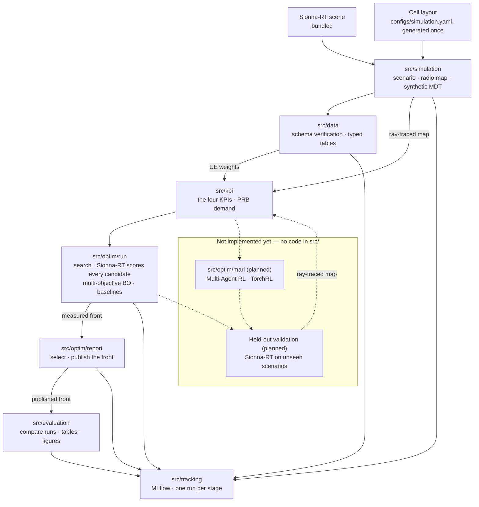

# MULTI-BAND TILT COORDINATION FOR COVERAGE EFFICIENT 5G/6G RAN

Research code comparing trust-region Bayesian Optimization (TuRBO) and
Multi-Agent Reinforcement Learning for multi-band antenna tilt coordination in
5G/6G radio access networks.

[](LICENSE)
[](pyproject.toml)
[](#status-and-ownership)

## Status and ownership

| | |
|---|---|
| **Maturity** | **Alpha** — simulation, preprocessing, the Bayesian-optimization arm and the method comparison run end to end for one scenario, as one `task pipeline`, with every stage logged to MLflow; MARL and held-out validation have no code yet. |
| **Owner** | Nguyễn Duy Vũ |
| **Contact** | via [GitHub issues](https://github.com/NguyenVu04/band-tilt/issues) |
| **Source of record** | <https://github.com/NguyenVu04/band-tilt> |
| **Issue tracker** | <https://github.com/NguyenVu04/band-tilt/issues> |
| **Description of record** | this README, plus [CLAUDE.md](CLAUDE.md) |
| **Decisions** | [docs/adr/](docs/adr/) |

## Contents

- [Overview](#overview)
- [Architecture](#architecture)
- [Getting started](#getting-started)
- [Configuration](#configuration)
- [Usage](#usage)
- [Development](#development)
- [Testing](#testing)
- [Compliance and data handling](#compliance-and-data-handling)
- [Versioning and reproducibility](#versioning-and-reproducibility)
- [Governance](#governance)
- [Roadmap](#roadmap)

## Overview

A 5G/6G site commonly serves several frequency bands from the same location.
Those bands should not be configured as interchangeable coverage layers: low
bands such as 700 MHz propagate farther and penetrate obstacles better, while
higher bands such as 2600 MHz provide more capacity over a smaller area. A
mid-band layer connects those roles.

When each band is assigned a static antenna tilt independently, two failures
become likely. Bands may cover the same near-site area unnecessarily, wasting
radio resources and increasing interference, while the cell edge may develop a
coverage hole where the high-band signal fades before a low-band layer reaches
it. Manual, band-by-band tuning is slow and can miss these interactions.

This project treats tilt setting as one coordinated, multivariable optimization
problem. For `N` cells and `B` bands, the conceptual output is a tilt-offset
vector with one value for every `(cell, band)` pair:

```text
delta_tilt = [delta_tilt_1,1, ..., delta_tilt_1,B, ..., delta_tilt_N,B]
```

The optimizer aims to maximize the union coverage of all frequency layers while
reducing both redundant overlap and uncovered area. A useful solution preserves
the physical role of each band: low bands provide the coverage floor and reach
the cell edge, high bands concentrate service near the site, and mid bands bridge
the two. The intended network state includes each layer's signal-strength map,
demand, and band-specific propagation behaviour.

The repository evaluates this idea entirely in simulation. `src/simulation/`
loads a Sionna-RT scene, generates a time-varying UE population, ray-traces
per-band radio maps, and samples them to produce synthetic MDT. The implemented
optimizer searches legal **absolute tilt** settings and reports their offsets
from the incumbent configuration. Four shared KPIs - hole rate, overlap rate,
band priority (how many UEs the prioritised bands serve), and weak-signal rate -
score every candidate through [`src/kpi/`](src/kpi/); their definitions and
priority order are documented in
[ADR 0001](docs/adr/0001-five-kpis-under-lexicographic-priority.md).
[`src/kpi/capacity.py`](src/kpi/capacity.py) picks a serving cell-band per UE
under per-cell PRB limits; band priority counts that serving band, and the PRB
demand map built from it is a diagnostic outside the objective.

Sionna-RT scores every candidate the search proposes, at roughly 8 s each, and
`src/optim/report.py` selects from what was measured and publishes the front.
The multi-objective Bayesian Optimization path and two baselines are
implemented; Multi-Agent Reinforcement Learning and held-out scenario
validation remain planned.

The practical goal is to replace repeated manual tilt tuning with site-wide
coordination that removes avoidable coverage holes, reduces redundant overlap,
and assigns each frequency layer the role its propagation characteristics suit.
The project does not model a live-network deployment path, and its results are
not calibrated against operator measurements.

## Architecture



Solid arrows are implemented and run today; dashed arrows are the intended
design, not yet built. `src/kpi/` sits downstream of the simulator, so every
score in a run comes from one implementation. `src/evaluation/` reads run
directories off disk and re-solves nothing, which is what lets a comparison run
on a machine with no GPU. Every stage's entry point, and only the entry point,
logs its params, metrics and small artifacts to MLflow through `src/tracking.py`.

### Components

| Component | Responsibility | Location |
|---|---|---|
| Core | The `Cell` / per-band `Tilt` data model shared by every other module | [`src/core/`](src/core/) |
| Simulation | UE population, radio-map ray tracing, synthetic MDT | [`src/simulation/`](src/simulation/) |
| Data | Load the simulation output, verify it against its contract, write typed processed tables | [`src/data/`](src/data/) |
| KPI | The four KPI definitions, the reductions they share, and the serving-cell / PRB demand model | [`src/kpi/`](src/kpi/) |
| Utils | Seeding and plotting helpers shared by every notebook; `src/config.py` composes the config outside an entry point | [`src/utils/`](src/utils/) |
| Tracking | Logs one stage as one MLflow run: scalar params of the stage's config groups, the whole config, metrics, small artifacts; large data paths as tags | [`src/tracking.py`](src/tracking.py) |
| Optimization | The shared search space, the KPI vector and its priority rule, the Sionna-RT evaluator, three searches, and the run that publishes the front | [`src/optim/`](src/optim/) |
| Evaluation | Load finished runs, compare methods, write tables and figures to `reports/`; `run.py` is notebook 05 as a script. Re-solves nothing — the Sionna-RT held-out validation is still missing | [`src/evaluation/`](src/evaluation/) |
| Notebooks | The pipeline, one notebook per phase | [`notebooks/`](notebooks/) |
| Configuration | Every tunable, in Hydra groups | [`configs/`](configs/) |

### External dependencies

| Dependency | Purpose | Criticality | Notes |
|---|---|---|---|
| [Sionna-RT](https://nvlabs.github.io/sionna/) | The bundled scene, and ray-traced radio maps every downstream artifact derives from | **Critical** | `--extra rt`; needs a CUDA GPU to be practical |
| Cell layout and tilt bounds | Band, carrier, power and per-band tilt bounds per cell | Resolved | Generated once by `task simulation:layout` and committed in [`configs/simulation.yaml`](configs/simulation.yaml) — no external data needed |
| [Ax](https://ax.dev/) + [BoTorch](https://botorch.org/) | The GP model and hypervolume acquisition the BO arm runs on | In use | `--extra bo`; read by [`src/optim/methods/mobo/search.py`](src/optim/methods/mobo/search.py) and by `objective.hypervolume` |
| [TorchRL](https://pytorch.org/rl/) | The MARL environment, policy and trainer | Not yet used | `--extra marl`; no MARL code exists yet |
| [DVC](https://dvc.org/) | Data and artifact versioning | Optional | `--extra dvc`; see [`dvc.yaml`](dvc.yaml). **Not yet initialised in this repository** — there is no `.dvc/` directory or remote configured; `data/` is presently just gitignored |
| [MLflow](https://mlflow.org/) | Experiment tracking, one run per stage | In use | `--extra tracking`; imported lazily by [`src/tracking.py`](src/tracking.py) — without it, or with `mlflow.enabled=false`, stages run untracked |

## Getting started

### Prerequisites

| Requirement | Version | Notes |
|---|---|---|
| Python | `>=3.11,<3.14` | capped: hydra-core 1.3.x cannot build its argparse parser on 3.14 |
| [uv](https://docs.astral.sh/uv/) | 0.9+ | the only supported installer; `uv.lock` is committed |
| [Task](https://taskfile.dev/) | 3.x | the task runner; every command below assumes it |
| CUDA GPU | — | needed for `task simulation:radio` and `task simulation:mdt`; Sionna-RT ray tracing is impractically slow without one |
| Sionna-RT scene | — | bundled with the `rt` extra (`task sync:rt`); nothing supplied externally |

### Install

```bash
git clone https://github.com/NguyenVu04/band-tilt.git
cd band-tilt
task setup
```

`task setup` installs every extra and the pre-commit hooks. For data work alone,
`task sync` installs the base and dev environment without Sionna-RT, Ax/BoTorch
or TorchRL — a much smaller download.

### Configure

```bash
cp .env.example .env
# Fill in the required values — see Configuration below.
```

`.env` holds only environment-specific settings. Anything that affects a result
lives in `configs/`, so that Git history records what produced it.

### Verify

```bash
task check
```

Expected output:

```
uv run ruff check .
All checks passed!
uv run ruff format --check .
uv run pytest
179 passed
```

`tests/` covers `src/simulation/`'s density, region and traffic logic, the four
KPIs, and `src/optim/` and `src/evaluation/` — the parts most worth pinning down
by hand-computed fixtures. It does not yet cover `src/data/` or `src/core/`; see
[Implementation status](#implementation-status).

To confirm the active package tree is intact:

```bash
uv run python -c "import src.simulation, src.data, src.kpi, src.optim, src.evaluation, src.core, src.utils, src.tracking"
```

This must succeed silently.

## Configuration

Results-affecting settings live in [`configs/`](configs/) as Hydra groups,
composed by `src.config.load_config` into one `cfg` with `cfg.simulation`,
`cfg.kpi` and `cfg.data`, per [`configs/config.yaml`](configs/config.yaml)'s
`defaults` list.

| Group | File | Holds |
|---|---|---|
| `simulation` | [`configs/simulation.yaml`](configs/simulation.yaml) | scene, grid, UE population, the cell layout and tilt bounds, radio-map solver settings, MDT measurement noise, output paths |
| `kpi` | [`configs/kpi.yaml`](configs/kpi.yaml) | KPI thresholds, Band Priority Score weights, the per-KPI tie tolerances, and the placeholder `capacity` block for the serving rule and PRB demand. The priority *order* is not here — it is `KPI_NAMES` in [`src/optim/objective.py`](src/optim/objective.py) |
| `data` | [`configs/data.yaml`](configs/data.yaml) | output paths for the two processed tables |

[`configs/optim/base.yaml`](configs/optim/base.yaml) configures what every
optimization run shares — the output directories and the seed — and the
`optim/method` group ([`configs/optim/method/`](configs/optim/method)) holds one
file per method with that method's own budget or sweep settings. Select one with
`optim/method=rule`; note the slash, it is a config group and not a key.

[`configs/config.yaml`](configs/config.yaml)'s `mlflow` block holds `enabled`,
`tracking_uri` and `experiment_name`. The tracking URI defaults to
`sqlite:///mlflow.db`: MLflow 3.x refuses the old `./mlruns` file store unless
`MLFLOW_ALLOW_FILE_STORE` is set. Artifacts still land in `./mlruns/`. Both are
gitignored.

Override from the command line, e.g. `task simulation:radio -- seed=7`.

Environment variables, from `.env.example`:

| Name | Type | Default | Required | Secret | Description |
|---|---|---|---|---|---|
| `MLFLOW_TRACKING_URI` | string | `sqlite:///mlflow.db` | no | no | Where experiment runs are recorded; read by `configs/config.yaml` through `oc.env` |
| `DVC_REMOTE_URL` | string | — | no | **yes** | Remote for `dvc push` / `dvc pull`; may embed credentials |
| `DATA_ROOT` | string | `./data` | no | no | Override when the dataset lives outside the repository |

Precedence: command-line Hydra overrides > environment variables > `configs/`
defaults. `Taskfile.yml` loads `.env` for every task; a plain `python -m` run
sees only what the shell exports.

`.env` is gitignored and there is no secret manager — this is a research
repository, and `DVC_REMOTE_URL` is the only value that may carry a credential.

## Usage

The implemented part of the pipeline runs as a chain of notebooks, or as scripts
through the task runner and `dvc repro`. Both call the same functions in
`src/`, so they cannot diverge.

| Phase | Notebook | Script |
|---|---|---|
| 1 — Generate the scenario, radio maps and synthetic MDT | [`00_simulation`](notebooks/00_simulation.ipynb) | `task simulation` (`simulation:scenario` → `simulation:radio` → `simulation:mdt`) |
| 2 — Explore the simulation output; specify notebook 02 | [`01_eda`](notebooks/01_eda.ipynb) | — (read-only, writes no artifacts) |
| 3 — Verify and type the processed tables | [`02_preprocessing`](notebooks/02_preprocessing.ipynb) | `task preprocess` |
| 4 — Optimize with the baselines | [`04a_baseline`](notebooks/04a_baseline.ipynb) | `task baseline` (add `-- optim/method=rule` for the rule-based search) |
| 5 — Optimize with multi-objective Bayesian Optimization | [`04b_mobo`](notebooks/04b_mobo.ipynb) | `task bo` |
| 4–5 for every method | — | `task optim` |
| 6 — Compare the runs, write the tables and figures | [`05_evaluation`](notebooks/05_evaluation.ipynb) | `task evaluate` (reads run directories; writes to `reports/`) |

```bash
task pipeline           # every stage below, in order
task simulation         # the three simulation stages, in order
task preprocess         # verify and type the processed tables
task optim              # optimize with every method (GPU)
task evaluate           # compare the newest run of each method
task mlflow             # browse the tracked runs
task lab                # start JupyterLab
task dvc:repro          # simulation through optimization via DVC, skipping what's unchanged
```

Arguments after `--` go to every stage a task runs, e.g.
`task pipeline -- seed=7`. `task dvc:repro` stops at optimization for one
method: a run writes a timestamped directory, which has no fixed output for DVC
to track — see the header of
[`dvc.yaml`](dvc.yaml).

### Changing the pipeline later

| To change | Edit |
|---|---|
| A tunable | the matching file in [`configs/`](configs/), or a `--` override |
| Which methods `task optim` runs | `METHODS` in [`Taskfile.yml`](Taskfile.yml) |
| Add a search method | a folder under [`src/optim/methods/`](src/optim/methods/), its entry in `SEARCHES` in [`src/optim/methods/__init__.py`](src/optim/methods/__init__.py), a `configs/optim/method/<name>.yaml`, and its name in `METHODS` |
| Add a stage | a module with a `@hydra.main` `main` that ends in `log_stage(...)`, a Taskfile task, and a line in `pipeline` |
| What a stage logs to MLflow | the `log_stage(...)` call in that stage's `main` |

### Experiment tracking

Every stage entry point opens one MLflow run named after the stage, in the
`band-tilt` experiment. Each run carries the scalar params of the stage's
config groups, the whole resolved config as `config.yaml`, the Git commit
(MLflow's own `mlflow.source.git.*` tags), and:

| Stage | Metrics | Artifacts |
|---|---|---|
| `simulation_*`, `preprocessing` | — | output paths as `output.*` tags, not copied |
| `optimization` | the winner's four KPIs, candidates measured, front size | the run's parquet tables, `run.json`, the `reports/outputs/` deliverables |
| `evaluation` | the four KPIs of each method's best | `reports/{figures,tables}/05_evaluation/` |

Radio maps and the UE tables stay out of the store — data belongs to DVC. Set `mlflow.enabled=false` to run a stage untracked.

### The optimization run

One command, `task bo`. Sionna-RT scores every candidate at the configured
fidelity, so every KPI a run writes is a measurement and the run it leaves is
complete. It needs a GPU.

Ray tracing one tilt configuration costs about 8 s against a warm kernel cache,
so the 160-evaluation default budget is roughly 22 minutes. Older documents in
this repository put it at 30–40 s, which was cold-compilation time; the
measurement is in
[`outputs/fidelity_bench/`](outputs/fidelity_bench/).

A run writes `outputs/optim/<method>/<timestamp>/` — the per-candidate history,
the Pareto subset, `best_tilt.parquet`, `best_radio_map.npz`, `run.json` and
`pareto_verified.parquet`, the last being the solutions offered for choice.

Which solutions get offered is not the priority order: that would return eight
neighbours from one corner of the front. They are ranked by NSGA-II crowding
distance, which keeps the extremes and spreads the rest. `optim.n_solutions`
sets how many, 8 by default, always including the incumbent and the winner.

**The deliverable is the front.** `reports/outputs/` gets
`pareto_<method>.csv` — one row per measured Pareto solution, its four KPIs and
each one's delta against the incumbent — and `tilt_options_<method>.csv`, the
tilt table each of those becomes. ADR 0001's priority order marks one row
`recommended` and `tilt_change_<method>.csv` carries it, but choosing among
measured trade-offs is left to a person. The MARL arm is not built, so a
comparison currently has BO and the two baselines in it and nothing else.

Each notebook opens in Colab from the badge in its first cell; the bootstrap
cell clones the repository and installs what Colab does not ship.

## Development

### Layout

```
band-tilt/
├── configs/       Hydra config groups — every tunable
├── data/          gitignored; scenario, radio map and MDT artifacts (DVC not yet initialised — see External dependencies)
├── docs/adr/      architecture decision records
├── notebooks/     one per pipeline phase, 00 through 05
├── outputs/       gitignored; one directory per optimization run
├── mlruns/        gitignored; MLflow artifacts (runs are in mlflow.db)
├── reports/       tables, figures and the republished tilt deliverable
├── src/           importable project logic
├── tests/         unit tests for simulation, the KPIs, optim, evaluation and tracking
└── Taskfile.yml   every command
```

### Implementation status

| Area | State |
|---|---|
| `src/core/` — the `Cell` / `Tilt` data model | Implemented |
| `src/simulation/` — scenario, scene, materials, transmitters, radio map, MDT | Implemented; runs end to end for one scenario (`task simulation`) |
| `src/data/` — load, schema verification, processed-table build | Implemented (`task preprocess`) |
| `src/kpi/` — the four KPIs (`hole`, `overlap`, `bps`, `weak`), with `capacity.py` | Implemented and unit-tested (`tests/test_kpi.py`, `tests/test_capacity.py`); scored on every evaluation by `src/optim/evaluator.py` and read by `src/evaluation/maps.py` |
| `src/utils/` — config loading, seeding, plotting | Implemented |
| `notebooks/` — `00_simulation` through `05_evaluation` | All eight written and adapted to this project |
| `src/optim/` | Implemented and unit-tested: the tilt space, the KPI vector, the Sionna-RT evaluator, Ax multi-objective BO, random-search and rule-based baselines, and the run that searches, selects and publishes |
| `src/evaluation/` | Implemented and unit-tested: loading runs, coverage and demand rasters, comparison tables, figures, export to `reports/`, and `run.py` (`task evaluate`). Reads artifacts only — it never re-solves |
| `src/tracking.py` — MLflow | Implemented and unit-tested (`tests/test_tracking.py`); called from every stage entry point |
| `task pipeline` | Chains every stage. Not yet run end to end in one go; `task evaluate` has run only against synthetic run directories |
| `src/optim/marl/` | Does not exist |
| CI | None. `task lint` and `task test` run locally only. |

#### Known gaps in the active pipeline

| Gap | Consequence |
|---|---|
| Only one scenario is on disk | The intended between-scenario train/validation/test split cannot be made yet — see `01_eda.ipynb` section 11. Every optimized configuration is therefore tuned and scored on the same world |
| `kpi.capacity` values are placeholders | The serving rule and PRB demand map in [`src/kpi/capacity.py`](src/kpi/capacity.py) run on placeholder SCS, PRB limits, per-UE throughput, RSRP threshold and noise figure, flagged in [`configs/kpi.yaml`](configs/kpi.yaml). The Band Priority Score counts the serving band, so an objective depends on them |
| No held-out re-evaluation | `src/evaluation/` compares runs already on disk. Nothing re-solves an optimized tilt on an unseen scenario, so no number here measures transfer |

### Standards

| | |
|---|---|
| **Style and lint** | `ruff` with `E`, `F`, `I`, `UP`, `B`, `D` (Google docstrings), enforced by pre-commit and `task lint` |
| **Commits** | [Conventional Commits](https://www.conventionalcommits.org/) |
| **Branching** | short-lived branches off `main` |
| **Review** | self-review before merge — see [Governance](#governance) |

### Local loop

```bash
task format
task check
```

## Testing

| Tier | Scope | Command | Where it runs |
|---|---|---|---|
| Unit | `src/simulation/`'s density, region and traffic logic; the four KPIs and the capacity model; `src/optim/`'s space, objective, searches and publishing; `src/evaluation/`; `src/tracking.py` against a temporary SQLite store — all against synthetic fixtures | `task test` | pre-commit, locally |
| Single test | One behaviour | `uv run pytest tests/test_kpi.py -k <name>` | locally |

**There is no coverage gate and no CI.** `tests/` currently covers
`src/simulation/`'s `density.py`, `sample.py` (region) and `traffic.py`,
`src/kpi/`, `src/optim/`, `src/evaluation/` and
`src/tracking.py` — 179 tests, all passing, none skipped. `src/data/`,
`src/core/` and `src/evaluation/run.py` have no tests yet.

The one rule the tests hold to: **no test touches Sionna-RT, a GPU, or a real
dataset.** Fixtures are tiny and synthetic, so `task test` runs the same way in
CI as on a laptop with no GPU — once CI exists.

## License

MIT — see [LICENSE](LICENSE).
