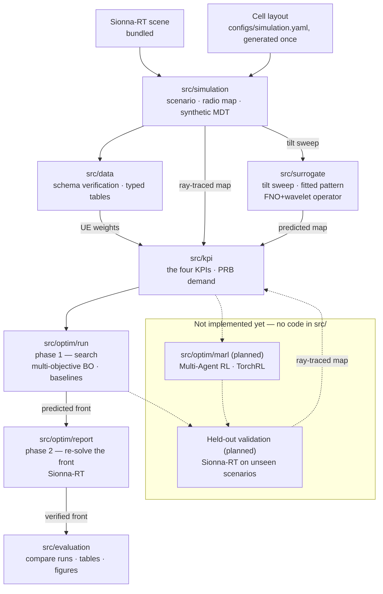

# MULTI-BAND TILT COORDINATION FOR COVERAGE EFFICIENT 5G/6G RAN

Research code comparing trust-region Bayesian Optimization (TuRBO) and
Multi-Agent Reinforcement Learning for multi-band antenna tilt coordination in
5G/6G radio access networks.

[](LICENSE)
[](pyproject.toml)
[](#status-and-ownership)

## Status and ownership

| | |
|---|---|
| **Maturity** | **Alpha** — simulation, preprocessing, the tilt-delta surrogate, the Bayesian-optimization arm and run reporting run end to end for one scenario; MARL and held-out validation have no code yet. |
| **Owner** | Nguyễn Duy Vũ |
| **Contact** | via [GitHub issues](https://github.com/NguyenVu04/band-tilt/issues) |
| **Source of record** | <https://github.com/NguyenVu04/band-tilt> |
| **Issue tracker** | <https://github.com/NguyenVu04/band-tilt/issues> |
| **Description of record** | this README, plus [CLAUDE.md](CLAUDE.md) |
| **Decisions** | [docs/adr/](docs/adr/) |

## Contents

- [Overview](#overview)
- [Architecture](#architecture)
- [Getting started](#getting-started)
- [Configuration](#configuration)
- [Usage](#usage)
- [Development](#development)
- [Testing](#testing)
- [Compliance and data handling](#compliance-and-data-handling)
- [Versioning and reproducibility](#versioning-and-reproducibility)
- [Governance](#governance)
- [Roadmap](#roadmap)

## Overview

A 5G/6G site commonly serves several frequency bands from the same location.
Those bands should not be configured as interchangeable coverage layers: low
bands such as 700 MHz propagate farther and penetrate obstacles better, while
higher bands such as 2600 MHz provide more capacity over a smaller area. A
mid-band layer connects those roles.

When each band is assigned a static antenna tilt independently, two failures
become likely. Bands may cover the same near-site area unnecessarily, wasting
radio resources and increasing interference, while the cell edge may develop a
coverage hole where the high-band signal fades before a low-band layer reaches
it. Manual, band-by-band tuning is slow and can miss these interactions.

This project treats tilt setting as one coordinated, multivariable optimization
problem. For `N` cells and `B` bands, the conceptual output is a tilt-offset
vector with one value for every `(cell, band)` pair:

```text
delta_tilt = [delta_tilt_1,1, ..., delta_tilt_1,B, ..., delta_tilt_N,B]
```

The optimizer aims to maximize the union coverage of all frequency layers while
reducing both redundant overlap and uncovered area. A useful solution preserves
the physical role of each band: low bands provide the coverage floor and reach
the cell edge, high bands concentrate service near the site, and mid bands bridge
the two. The intended network state includes each layer's signal-strength map,
demand, and band-specific propagation behaviour.

The repository evaluates this idea entirely in simulation. `src/simulation/`
loads a Sionna-RT scene, generates a time-varying UE population, ray-traces
per-band radio maps, and samples them to produce synthetic MDT. The implemented
optimizer searches legal **absolute tilt** settings and reports their offsets
from the incumbent configuration. Four shared KPIs - hole rate, overlap rate,
UE-weighted band priority, and weak-signal rate - score every candidate through
[`src/kpi/`](src/kpi/); their definitions and priority order are documented in
[ADR 0001](docs/adr/0001-five-kpis-under-lexicographic-priority.md). Beside
them, [`src/kpi/capacity.py`](src/kpi/capacity.py) picks a serving cell-band per
UE under per-cell PRB limits and turns that into the PRB demand map, a
diagnostic that is not part of the objective.

Because ray tracing is too slow for the inner search loop, `src/surrogate/`
predicts changed radio maps. `src/optim/report.py` then re-evaluates selected
Pareto solutions with Sionna-RT and publishes only the measured front. The
multi-objective Bayesian Optimization path and two baselines are implemented;
Multi-Agent Reinforcement Learning and held-out scenario validation remain
planned.

The practical goal is to replace repeated manual tilt tuning with site-wide
coordination that removes avoidable coverage holes, reduces redundant overlap,
and assigns each frequency layer the role its propagation characteristics suit.
The project does not model a live-network deployment path, and its results are
not calibrated against operator measurements.

## Architecture



Solid arrows are implemented and run today; dashed arrows are the intended
design, not yet built. `src/kpi/` sits downstream of the simulator and of the
surrogate alike, so a predicted score and a measured one are computed by the
same functions and stay comparable. `src/evaluation/` reads run
directories off disk and re-solves nothing, which is what lets a comparison run
on a machine with no GPU.

### Components

| Component | Responsibility | Location |
|---|---|---|
| Core | The `Cell` / per-band `Tilt` data model shared by every other module | [`src/core/`](src/core/) |
| Simulation | UE population, radio-map ray tracing, synthetic MDT | [`src/simulation/`](src/simulation/) |
| Data | Load the simulation output, verify it against its contract, write typed processed tables | [`src/data/`](src/data/) |
| KPI | The four KPI definitions, the reductions they share, and the serving-cell / PRB demand model | [`src/kpi/`](src/kpi/) |
| Utils | Config loading, seeding, plotting helpers shared by every notebook | [`src/utils/`](src/utils/) |
| Surrogate | Predicts the radio map after a tilt change, so the search needs no ray tracing | [`src/surrogate/`](src/surrogate/) |
| Optimization | The shared search space, the KPI vector and its priority rule, both evaluators, three searches, and the two-phase run and report | [`src/optim/`](src/optim/) |
| Evaluation | Load finished runs, compare methods, write tables and figures to `reports/`. Re-solves nothing — the Sionna-RT held-out validation is still missing | [`src/evaluation/`](src/evaluation/) |
| Notebooks | The pipeline, one notebook per phase | [`notebooks/`](notebooks/) |
| Configuration | Every tunable, in Hydra groups | [`configs/`](configs/) |

`app/` (FastAPI + Streamlit serving) is unrelated template scaffolding left over
from the project's starting point — see
[Implementation status](#implementation-status).

### External dependencies

| Dependency | Purpose | Criticality | Notes |
|---|---|---|---|
| [Sionna-RT](https://nvlabs.github.io/sionna/) | The bundled scene, and ray-traced radio maps every downstream artifact derives from | **Critical** | `--extra rt`; needs a CUDA GPU to be practical |
| Cell layout and tilt bounds | Band, carrier, power and per-band tilt bounds per cell | Resolved | Generated once by `task simulation:layout` and committed in [`configs/simulation.yaml`](configs/simulation.yaml) — no external data needed |
| [Ax](https://ax.dev/) + [BoTorch](https://botorch.org/) | The GP model and hypervolume acquisition the BO arm runs on | In use | `--extra bo`; read by [`src/optim/methods/mobo/search.py`](src/optim/methods/mobo/search.py) and by `objective.hypervolume` |
| [TorchRL](https://pytorch.org/rl/) | The MARL environment, policy and trainer | Not yet used | `--extra marl`; no MARL code exists yet |
| [DVC](https://dvc.org/) | Data and artifact versioning | Optional | `--extra dvc`; see [`dvc.yaml`](dvc.yaml). **Not yet initialised in this repository** — there is no `.dvc/` directory or remote configured; `data/` is presently just gitignored |
| [MLflow](https://mlflow.org/) | Experiment tracking | Optional | `--extra tracking`; imported lazily; not yet called from the active pipeline |

## Getting started

### Prerequisites

| Requirement | Version | Notes |
|---|---|---|
| Python | `>=3.11,<3.14` | capped: hydra-core 1.3.x cannot build its argparse parser on 3.14 |
| [uv](https://docs.astral.sh/uv/) | 0.9+ | the only supported installer; `uv.lock` is committed |
| [Task](https://taskfile.dev/) | 3.x | the task runner; every command below assumes it |
| CUDA GPU | — | needed for `task simulation:radio` and `task simulation:mdt`; Sionna-RT ray tracing is impractically slow without one |
| Sionna-RT scene | — | bundled with the `rt` extra (`task sync:rt`); nothing supplied externally |

### Install

```bash
git clone https://github.com/NguyenVu04/band-tilt.git
cd band-tilt
task setup
```

`task setup` installs every extra and the pre-commit hooks. For data work alone,
`task sync` installs the base and dev environment without Sionna-RT, Ax/BoTorch
or TorchRL — a much smaller download.

### Configure

```bash
cp .env.example .env
# Fill in the required values — see Configuration below.
```

`.env` holds only environment-specific settings. Anything that affects a result
lives in `configs/`, so that Git history records what produced it.

### Verify

```bash
task check
```

Expected output:

```
uv run ruff check .
All checks passed!
uv run ruff format --check .
uv run pytest
183 passed
```

`tests/` covers `src/simulation/`'s density, region and traffic logic, the four
KPIs, and `src/optim/` and `src/evaluation/` — the parts most worth pinning down
by hand-computed fixtures. It does not yet cover `src/data/` or `src/core/`; see
[Implementation status](#implementation-status).

To confirm the active package tree is intact:

```bash
uv run python -c "import src.simulation, src.data, src.kpi, src.optim, src.evaluation, src.core, src.utils"
```

This must succeed silently.

## Configuration

Results-affecting settings live in [`configs/`](configs/) as Hydra groups,
composed by `src.config.load_config` into one `cfg` with `cfg.simulation`,
`cfg.kpi` and `cfg.data`, per [`configs/config.yaml`](configs/config.yaml)'s
`defaults` list.

| Group | File | Holds |
|---|---|---|
| `simulation` | [`configs/simulation.yaml`](configs/simulation.yaml) | scene, grid, UE population, the cell layout and tilt bounds, radio-map solver settings, MDT measurement noise, output paths |
| `kpi` | [`configs/kpi.yaml`](configs/kpi.yaml) | KPI thresholds, Band Priority Score weights, the per-KPI tie tolerances, and the placeholder `capacity` block for the serving rule and PRB demand. The priority *order* is not here — it is `KPI_NAMES` in [`src/optim/objective.py`](src/optim/objective.py) |
| `data` | [`configs/data.yaml`](configs/data.yaml) | output paths for the two processed tables |

[`configs/optim/base.yaml`](configs/optim/base.yaml) configures what every
optimization run shares — the output directories and the seed — and the
`optim/method` group ([`configs/optim/method/`](configs/optim/method)) holds one
file per method with that method's own budget or sweep settings. Select one with
`optim/method=rule`; note the slash, it is a config group and not a key.

Override from the command line, e.g. `task simulation:radio -- seed=7`.

Environment variables, from `.env.example`:

| Name | Type | Default | Required | Secret | Description |
|---|---|---|---|---|---|
| `MLFLOW_TRACKING_URI` | string | `./mlruns` | no | no | Where experiment runs are recorded |
| `DVC_REMOTE_URL` | string | — | no | **yes** | Remote for `dvc push` / `dvc pull`; may embed credentials |
| `DATA_ROOT` | string | `./data` | no | no | Override when the dataset lives outside the repository |

Precedence: command-line Hydra overrides > environment variables > `configs/`
defaults.

`.env` is gitignored and there is no secret manager — this is a research
repository, and `DVC_REMOTE_URL` is the only value that may carry a credential.

## Usage

The implemented part of the pipeline runs as a chain of notebooks, or as scripts
through the task runner and `dvc repro`. Both call the same functions in
`src/`, so they cannot diverge.

| Phase | Notebook | Script |
|---|---|---|
| 1 — Generate the scenario, radio maps and synthetic MDT | [`00_simulation`](notebooks/00_simulation.ipynb) | `task simulation` (`simulation:scenario` → `simulation:radio` → `simulation:mdt`) |
| 2 — Explore the simulation output; specify notebook 02 | [`01_eda`](notebooks/01_eda.ipynb) | — (read-only, writes no artifacts) |
| 3 — Verify and type the processed tables | [`02_preprocessing`](notebooks/02_preprocessing.ipynb) | `python -m src.data.build` |
| 4 — Sweep the tilt range and fit the antenna pattern | [`03a_surrogate_data`](notebooks/03a_surrogate_data.ipynb) | `task surrogate:dataset` |
| 5 — Train and score the tilt-delta surrogate | [`03b_surrogate_model`](notebooks/03b_surrogate_model.ipynb) | `task surrogate:train` |
| 6 — Search with the baselines (phase 1) | [`04a_baseline`](notebooks/04a_baseline.ipynb) | `task baseline` (add `-- optim/method=rule` for the rule-based search) |
| 7 — Search with multi-objective Bayesian Optimization (phase 1) | [`04b_mobo`](notebooks/04b_mobo.ipynb) | `task bo` |
| 8 — Re-solve the searched front with Sionna-RT (phase 2) | — (both notebooks call it at the end) | `task optim:report` |
| 9 — Compare the runs, write the tables and figures | [`05_evaluation`](notebooks/05_evaluation.ipynb) | — (reads run directories; writes to `reports/`) |

```bash
task lab                # start JupyterLab
task simulation         # the three simulation stages, in order
task surrogate:dataset  # sweep the tilt range (GPU), then
task surrogate:train    # fit the operator the search scores with
task optim              # both phases: task bo, then task optim:report
task dvc:repro          # the pipeline through DVC, skipping what's unchanged
```

### The two optimization phases

Ray tracing one tilt configuration costs 30–40 s, so searching with it costs
hours. The search and the measurement are therefore split, and only the second
half needs a GPU.

**Phase 1, `task bo`.** Scores every candidate with the surrogate and writes
`outputs/optim/<method>/<timestamp>/` — the per-candidate history, the predicted
Pareto subset, and a `run.json` marked `verified: false`. There is no winner and
no deliverable, because nothing here has been measured. `src/evaluation` refuses
to load such a run rather than let a prediction be read as a result.

**Phase 2, `task optim:report`.** Re-solves that run's front with Sionna-RT —
`optim.report.n_solutions` of them, 8 by default, always including the incumbent
— re-derives the Pareto front from what it measured, and completes the run
directory with `best_tilt.parquet`, `best_radio_map.npz` and
`pareto_verified.parquet`. The last of those records the surrogate's error on
exactly the solutions it recommended, so every run reports how far the model was
off rather than assuming the training numbers still hold.

Which solutions get re-solved is not the priority order: that would return eight
neighbours from one corner of the front. They are ranked by NSGA-II crowding
distance, which keeps the extremes and spreads the rest.

**The deliverable is the front.** `reports/outputs/` gets
`pareto_<method>.csv` — one row per measured Pareto solution, its four KPIs and
each one's delta against the incumbent — and `tilt_options_<method>.csv`, the
tilt table each of those becomes. ADR 0001's priority order marks one row
`recommended` and `tilt_change_<method>.csv` carries it, but choosing among
measured trade-offs is left to a person. The MARL arm is not built, so a
comparison currently has BO and the two baselines in it and nothing else.

Three Taskfile entries are dead, calling modules that do not exist:
`task clean:data` (`src.data.clean`), `task marl` (`src.optim.marl.train`),
`task validate` (`src.evaluation.validate`). See
[Implementation status](#implementation-status).

Each notebook opens in Colab from the badge in its first cell; the bootstrap
cell clones the repository and installs what Colab does not ship.

## Development

### Layout

```
band-tilt/
├── configs/       Hydra config groups — every tunable
├── data/          gitignored; scenario, radio map and MDT artifacts (DVC not yet initialised — see External dependencies)
├── docs/adr/      architecture decision records
├── notebooks/     one per pipeline phase, 00 through 05
├── outputs/       gitignored; one directory per optimization run
├── reports/       tables, figures and the republished tilt deliverable
├── src/           importable project logic
├── tests/         unit tests for simulation, the KPIs, optim and evaluation
├── app/           template serving scaffolding — see Implementation status
└── Taskfile.yml   every command
```

### Implementation status

| Area | State |
|---|---|
| `src/core/` — the `Cell` / `Tilt` data model | Implemented |
| `src/simulation/` — scenario, scene, materials, transmitters, radio map, MDT | Implemented; runs end to end for one scenario (`task simulation`) |
| `src/data/` — load, schema verification, processed-table build | Implemented (`python -m src.data.build`) |
| `src/kpi/` — the four KPIs (`hole`, `overlap`, `bps`, `weak`), with `serving.py`, `tiles.py` and `capacity.py` | Implemented and unit-tested (`tests/test_kpi.py`, `tests/test_capacity.py`); scored on every evaluation by `src/optim/evaluator.py` and read by `src/evaluation/maps.py` |
| `src/utils/` — config loading, seeding, plotting | Implemented |
| `notebooks/` — `00_simulation` through `05_evaluation` | All eight written and adapted to this project |
| `src/optim/` | Implemented and unit-tested: the tilt space, the KPI vector, the Sionna-RT evaluator, Ax multi-objective BO, random-search and rule-based baselines, and the two phases — `run.py` searches with the surrogate, `report.py` re-solves the front |
| `src/evaluation/` | Implemented and unit-tested: loading runs, coverage and demand rasters, comparison tables, figures, export to `reports/`. Reads artifacts only — it never re-solves |
| `src/surrogate/` | Implemented and unit-tested: scene channels, the tilt sweep, the fitted antenna pattern, the FNO + wavelet operator, training, and a `SurrogateEvaluator` that satisfies the same `ObjectiveEvaluator` protocol the ray tracer does |
| `src/optim/marl/` | Does not exist |
| `app/` (FastAPI + Streamlit) | Untouched template scaffolding. Out of scope; `app/api/dependencies.py` still refers to `cfg.models.artifact_path`, which does not compose against `configs/config.yaml` |
| CI | None. `task lint` and `task test` run locally only. |

#### Known gaps in the active pipeline

| Gap | Consequence |
|---|---|
| Only one scenario is on disk | The intended between-scenario train/validation/test split cannot be made yet — see `01_eda.ipynb` section 11. Every optimized configuration is therefore tuned and scored on the same world |
| `kpi.capacity` values are placeholders | The serving rule and PRB demand map in [`src/kpi/capacity.py`](src/kpi/capacity.py) run on placeholder SCS, PRB limits, per-UE throughput, RSRP threshold and noise figure, flagged in [`configs/kpi.yaml`](configs/kpi.yaml). The demand map is a diagnostic, so no KPI depends on them |
| No held-out re-evaluation | `src/evaluation/` compares runs already on disk. Nothing re-solves an optimized tilt on an unseen scenario, so no number here measures transfer |
| `task clean:data` calls `src.data.clean`, which does not exist | Dead task; the legacy operator-export cleaning it used to run is retired, see [Compliance and data handling](#compliance-and-data-handling) |
| `task marl`, `task validate` | Dead tasks — they call `src.optim.marl.train` and `src.evaluation.validate`, neither of which exists |
| A fully ray-traced search is no longer reachable | `task bo` always searches with the surrogate. Reproducing a pre-2026-09-09 run means reverting the code; see the revision note in [ADR 0002](docs/adr/0002-bayesian-optimization-without-a-trust-region.md) |

### Standards

| | |
|---|---|
| **Style and lint** | `ruff` with `E`, `F`, `I`, `UP`, `B`, `D` (Google docstrings), enforced by pre-commit and `task lint` |
| **Commits** | [Conventional Commits](https://www.conventionalcommits.org/) |
| **Branching** | short-lived branches off `main` |
| **Review** | self-review before merge — see [Governance](#governance) |

### Local loop

```bash
task format
task check
```

## Testing

| Tier | Scope | Command | Where it runs |
|---|---|---|---|
| Unit | `src/simulation/`'s density, region and traffic logic; the four KPIs and the capacity model; `src/optim/`'s space, objective, searches and report phase; `src/surrogate/`'s operator and dataset; `src/evaluation/` — all against synthetic fixtures | `task test` | pre-commit, locally |
| Single test | One behaviour | `uv run pytest tests/test_kpi.py -k <name>` | locally |

**There is no coverage gate and no CI.** `tests/` currently covers
`src/simulation/`'s `density.py`, `sample.py` (region) and `traffic.py`,
`src/kpi/`, `src/optim/`, `src/surrogate/` and `src/evaluation/` — 183 tests,
all passing, none skipped. `src/data/` and `src/core/` have no tests yet.

The one rule the tests hold to: **no test touches Sionna-RT, a GPU, or a real
dataset.** Fixtures are tiny and synthetic, so `task test` runs the same way in
CI as on a laptop with no GPU — once CI exists.

## License

MIT — see [LICENSE](LICENSE).
