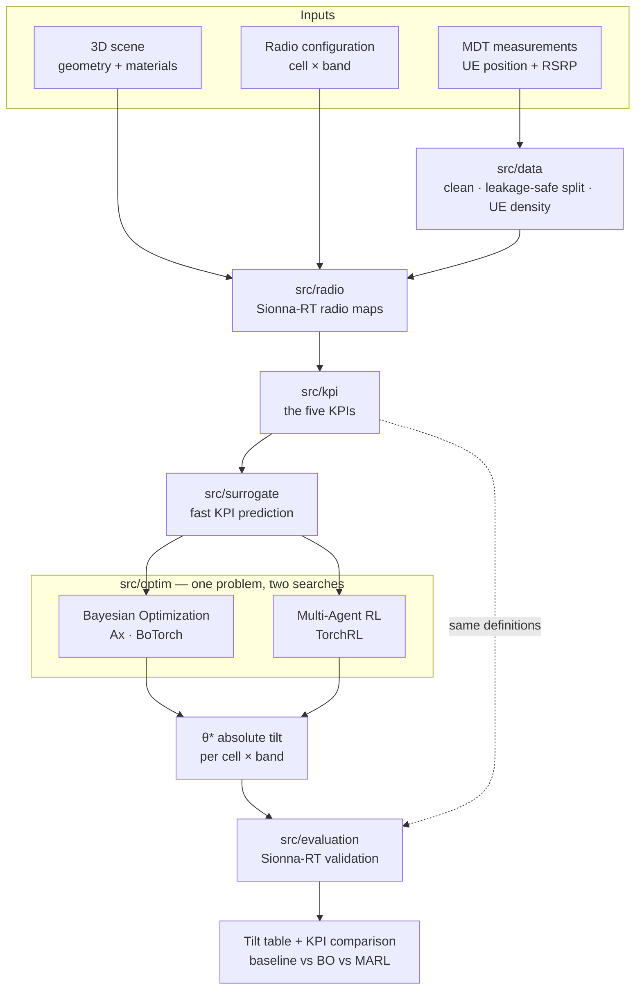

# band-tilt

Research code comparing Bayesian Optimization and Multi-Agent Reinforcement
Learning for multi-band antenna tilt coordination in 5G/6G radio access networks.

[](LICENSE)
[](pyproject.toml)
[](#status-and-ownership)

## Status and ownership

| | |
|---|---|
| **Maturity** | **Alpha** — contract-first. Interfaces, configs and decision records are in place; almost every function body is still unimplemented. |
| **Owner** | Nguyễn Duy Vũ |
| **Contact** | via [GitHub issues](https://github.com/NguyenVu04/band-tilt/issues) |
| **Source of record** | <https://github.com/NguyenVu04/band-tilt> |
| **Issue tracker** | <https://github.com/NguyenVu04/band-tilt/issues> |
| **Specification** | [PROJECT.md](PROJECT.md) |
| **Decisions** | [docs/adr/](docs/adr/) |

> [!IMPORTANT]
> **This repository does not yet run end to end.** Two things stand in the way,
> both deliberate and both documented:
>
> 1. **The multi-band cell configuration has not arrived.** The available export
>    has no band, carrier frequency, transmit power, or electrical/mechanical tilt
>    split — so the central quantity, one tilt per `(cell, band)` pair, cannot be
>    formed from real data.
> 2. **The code is contract-first.** Function bodies raise `NotImplementedError`
>    with their own dotted path; the docstrings, configs, tests and decision
>    records were written first so the shape of the problem is settled before any
>    implementation. See [Implementation status](#implementation-status).
>
> This is not an operated service and has no on-call rotation.

## Contents

- [Overview](#overview)
- [Architecture](#architecture)
- [Getting started](#getting-started)
- [Configuration](#configuration)
- [Usage](#usage)
- [Development](#development)
- [Testing](#testing)
- [Compliance and data handling](#compliance-and-data-handling)
- [Versioning and reproducibility](#versioning-and-reproducibility)
- [Governance](#governance)
- [Roadmap](#roadmap)

## Overview

Antenna downtilt is the cheapest lever a mobile operator has for shaping
coverage, and it is largely set by hand. Tilt a cell down and its footprint
shrinks: interference with neighbours falls, and coverage holes open at the cell
edge. Tilt it up and the reverse happens. With several frequency bands per site
the problem compounds — bands have different propagation characteristics, so they
should not cover the same footprint, and deciding which band should dominate
where is a coordination problem across dozens of coupled variables.

This project formulates that as a constrained optimization over **absolute tilt**
for every `(cell, band)` pair, evaluated against five KPIs computed from
Sionna-RT ray-traced radio maps, and compares two solution methods — Bayesian
Optimization and Multi-Agent RL — under one identical problem definition.

The full formulation, including the KPI mathematics, is in
[PROJECT.md](PROJECT.md).

### Capabilities

- **A single, testable objective.** Five KPIs — hole rate, overlap rate, weak
  rate, mean overlap neighbours, and a UE-weighted band priority score — defined
  once in `src/kpi/`, under a lexicographic priority of *Hole > Overlap > Weak*.
  They consume a plain RSRP array, so the whole objective is testable against
  hand-computed fixtures with no simulator involved.
- **A shared search space.** BO and MARL derive their bounds from the same module
  and score through the same functions, so the comparison measures the two
  methods rather than two implementations.
- **A KPI surrogate.** Ray tracing is too slow to sit inside a training loop, so a
  learned model stands in during search — while every reported number still comes
  from Sionna-RT.
- **Band-generic throughout.** Nothing hardcodes the number of bands. Adding one
  is an edit to `configs/radio.yaml`.

### Non-goals

- **Minimising reconfiguration effort.** The tilt offset is derived after
  optimization for reporting only; there is no penalty on how far an antenna
  moves. The research question is which configuration is best, not how to get
  there cheaply.
- **Accessibility, throughput, and interference KPIs.** Excluded from the
  formulation. The available data supports neither — MDT carries RSRP and
  position, not connection outcomes, and modelling throughput would need load and
  scheduler assumptions that would dominate the result
  ([ADR 0002](docs/adr/0002-five-kpis-under-lexicographic-priority.md)).
- **Reporting surrogate predictions as results.** The surrogate accelerates the
  search and never sources a reported number
  ([ADR 0003](docs/adr/0003-sionna-rt-is-ground-truth.md)).
- **Deployment to a live network.** There is no OSS/northbound integration and
  none is planned. The output is a tilt table, not a configuration push.

## Architecture



### Components

| Component | Responsibility | Location |
|---|---|---|
| Data | Load, validate, clean and split MDT; build the UE density grid | [`src/data/`](src/data/) |
| Radio | Scene construction, the cell-band table, radio-map generation, tilt sampling | [`src/radio/`](src/radio/) |
| KPI | The five KPIs, their priority, and candidate comparison — the objective | [`src/kpi/`](src/kpi/) |
| Surrogate | `D_sur` construction, features, the KPI predictor and its error report | [`src/surrogate/`](src/surrogate/) |
| Optimization | The shared search space and objective, plus BO and MARL | [`src/optim/`](src/optim/) |
| Evaluation | Sionna-RT validation, method comparison, spatial maps, reporting | [`src/evaluation/`](src/evaluation/) |
| Notebooks | The pipeline, one notebook per stage | [`notebooks/`](notebooks/) |
| Configuration | Every tunable, in Hydra groups | [`configs/`](configs/) |

The dependency direction between these is one-way and is documented in
[docs/adr/](docs/adr/) and enforced by review, not by tooling.

### External dependencies

| Dependency | Purpose | Criticality | Notes |
|---|---|---|---|
| [Sionna-RT](https://nvlabs.github.io/sionna/) | Ray-traced radio maps — the ground truth for every reported KPI | **Critical** | `--extra rt`; no reported result exists without it |
| MDT export | UE positions and RSRP; the spatial weight in KPI 5 | **Critical** | supplied externally, not in the repository |
| Multi-band cell configuration | Band, carrier, power and tilt bounds per cell-band | **Critical** | **not yet available** |
| [Ax](https://ax.dev/) + [BoTorch](https://botorch.org/) | The BO loop, GP model and acquisition functions | Degraded | `--extra bo`; MARL still runs without it |
| [TorchRL](https://pytorch.org/rl/) | The MARL environment, policy and trainer | Degraded | `--extra marl`; BO still runs without it |
| [DVC](https://dvc.org/) | Data and artifact versioning | Optional | `--extra dvc` |
| [MLflow](https://mlflow.org/) | Experiment tracking | Optional | `--extra tracking`; imported lazily |

## Getting started

### Prerequisites

| Requirement | Version | Notes |
|---|---|---|
| Python | `>=3.11,<3.14` | capped: hydra-core 1.3.x cannot build its argparse parser on 3.14 |
| [uv](https://docs.astral.sh/uv/) | 0.9+ | the only supported installer; `uv.lock` is committed |
| [Task](https://taskfile.dev/) | 3.x | the task runner; every command below assumes it |
| CUDA GPU | — | optional, but Sionna-RT ray tracing is impractically slow without one |
| MDT + cell configuration | — | supplied externally; `data/` is DVC-tracked and not in the clone |

### Install

```bash
git clone https://github.com/NguyenVu04/band-tilt.git
cd band-tilt
task setup
```

`task setup` installs every extra and the pre-commit hooks. For data work alone,
`task sync` installs the base and dev environment without Sionna-RT, Ax/BoTorch
or TorchRL — a much smaller download.

### Configure

```bash
cp .env.example .env
# Fill in the required values — see Configuration below.
```

`.env` holds only environment-specific settings. Anything that affects a result
lives in `configs/`, so that Git history records what produced it.

### Verify

```bash
task check
```

Expected output:

```
uv run ruff check .
All checks passed!
uv run ruff format --check .
56 files already formatted
uv run pytest
69 skipped
```

**69 skipped is the correct result.** Every test is a contract awaiting its
module — the skip reason names which one. A collection *error*, not a skip, is a
real failure.

To confirm the package tree is intact:

```bash
uv run python -c "import src.data, src.radio, src.kpi, src.surrogate, src.optim, src.evaluation"
```

This must succeed silently. Every module imports cleanly even though its
functions raise.

## Configuration

Results-affecting settings live in [`configs/`](configs/) as Hydra groups, and
are composed into `cfg.data`, `cfg.radio`, `cfg.kpi`, `cfg.surrogate` and
`cfg.optim`.

| Group | File | Holds |
|---|---|---|
| `data` | [`configs/data.yaml`](configs/data.yaml) | input paths, the data contract, cleaning rules, the split scheme |
| `radio` | [`configs/radio.yaml`](configs/radio.yaml) | the band table, tilt bounds, grid resolution, ray-tracing settings |
| `kpi` | [`configs/kpi.yaml`](configs/kpi.yaml) | KPI thresholds, priority order, tolerances, weights |
| `surrogate` | [`configs/surrogate.yaml`](configs/surrogate.yaml) | dataset, features, architecture, acceptance thresholds |
| `optim` | [`configs/optim/`](configs/optim/) | `bo.yaml` and `marl.yaml` — one is selected per run |

Override from the command line: `task bo -- optim.search.n_iter=50 seed=7`.

Lowercase `<placeholder>` values in `configs/` mark parameters PROJECT.md
section 30 leaves open. `src.config.validate_config` is the guard that stops one
reaching a numeric call site.

Environment variables, from `.env.example`:

| Name | Type | Default | Required | Secret | Description |
|---|---|---|---|---|---|
| `MLFLOW_TRACKING_URI` | string | `./mlruns` | no | no | Where experiment runs are recorded |
| `DVC_REMOTE_URL` | string | — | no | **yes** | Remote for `dvc push` / `dvc pull`; may embed credentials |
| `DATA_ROOT` | string | `./data` | no | no | Override when the dataset lives outside the repository |

Precedence: command-line Hydra overrides > environment variables > `configs/`
defaults.

`.env` is gitignored and there is no secret manager — this is a research
repository, and `DVC_REMOTE_URL` is the only value that may carry a credential.

## Usage

The pipeline runs as eight notebooks, or as scripts through the task runner. Both
call the same functions in `src/`, so they cannot diverge.

| Stage | Notebook | Script |
|---|---|---|
| Explore MDT and the cell configuration | [`00_eda`](notebooks/00_eda.ipynb) | — |
| Clean and split | [`01_clean_and_split`](notebooks/01_clean_and_split.ipynb) | `task clean:data` |
| Scene, radio map, baseline KPIs | [`02_scene_and_radiomap`](notebooks/02_scene_and_radiomap.ipynb) | — |
| Build the surrogate dataset | [`03_surrogate_dataset`](notebooks/03_surrogate_dataset.ipynb) | `task surrogate:dataset` |
| Train the surrogate | [`04_surrogate_modeling`](notebooks/04_surrogate_modeling.ipynb) | `task surrogate:train` |
| Bayesian Optimization | [`05a_bo`](notebooks/05a_bo.ipynb) | `task bo` |
| Multi-Agent RL | [`05b_marl`](notebooks/05b_marl.ipynb) | `task marl` |
| Validate and compare | [`06_evaluation`](notebooks/06_evaluation.ipynb) | `task validate` |

```bash
task lab                                  # start JupyterLab
task clean:data                           # the only stage that runs today
task bo -- optim.search.n_iter=100        # once the band data lands
task dvc:repro                            # the whole pipeline, in order
```

Each notebook opens in Colab from the badge in its first cell; the bootstrap cell
clones the repository and installs what Colab does not ship.

The deliverable is the tilt table from PROJECT.md section 27.1 — current tilt,
optimal tilt and the derived offset for every cell-band — plus the
baseline/BO/MARL KPI comparison.

## Development

### Layout

```
band-tilt/
├── configs/       Hydra config groups — every tunable
├── data/          DVC-tracked; raw MDT, cell config, 3D scene
├── docs/adr/      architecture decision records
├── notebooks/     the pipeline, one notebook per stage
├── src/           importable project logic
├── tests/         contract tests, skipped until their module exists
├── app/           template serving scaffolding — see Implementation status
├── PROJECT.md     the specification
└── Taskfile.yml   every command
```

### Implementation status

| Area | State |
|---|---|
| Configs, decision records, notebooks, tests | Written |
| `src/utils/plotting.py` | Implemented |
| Everything else in `src/` | `NotImplementedError` — contracts, not defects |
| `app/` (FastAPI + Streamlit) | Untouched template scaffolding. Out of scope for the current restructure; `app/api/dependencies.py` still refers to `cfg.models.artifact_path`, which no longer composes. |
| CI | None. `task lint` and `task test` run locally only. |

The numbered `# TODO(n)` comments in each stub are the intended implementation
order. `src/data/split.py` is the reference for the stub shape.

### Standards

| | |
|---|---|
| **Style and lint** | `ruff` with `E`, `F`, `I`, `UP`, `B`, `D` (Google docstrings), enforced by pre-commit and `task lint` |
| **Commits** | [Conventional Commits](https://www.conventionalcommits.org/) |
| **Branching** | short-lived branches off `main` |
| **Review** | self-review before merge — see [Governance](#governance) |

### Local loop

```bash
task format
task check
```

## Testing

| Tier | Scope | Command | Where it runs |
|---|---|---|---|
| Contract | Every module's interface, against synthetic fixtures | `task test` | pre-commit, locally |
| Single test | One behaviour | `uv run pytest tests/test_kpi.py::test_hole_rate_matches_hand_computed_value` | locally |

**There is no coverage gate and no CI.** With almost every function body
unimplemented, a coverage number would measure nothing; adding a threshold now
would be theatre. The suite is 69 contract tests, all skipped, each naming the
module that unblocks it — so the skip list doubles as the implementation
checklist.

Two rules the tests hold to:

- **No test touches the network, the real dataset, or Sionna-RT.** A suite that
  only runs after `dvc pull` stops being run. Fixtures in `tests/conftest.py` are
  tiny and synthetic.
- **Expected KPI values are computed by hand and asserted as literals.** A test
  that derives its expectation from the code under test asserts only that the
  implementation agrees with itself. The values documented on the `rsrp_grid`
  fixture were worked out by hand and are load-bearing.

## Compliance and data handling

The MDT export contains **device-level location traces** — a pseudonymous
identifier, coordinates, and a timestamp, per measurement. Sequences of those
points describe where a device went and when. That is personal data under most
regimes even though no name, MSISDN or IMSI appears, because trajectory data is
notoriously re-identifiable.

| | |
|---|---|
| **Data categories** | Pseudonymous device identifier, position in a local simulation frame, timestamp, serving cell, RSRP |
| **Identifiers** | `ue_id` and `gcell_id` are opaque 32-character hashes. `sim_x` / `sim_y` are a local metric frame, not WGS-84 — but the scene's geographic reference makes them georeferenceable. |
| **Volume** | 41,481 measurements from 1,490 devices over roughly two weeks |
| **Regimes** | **Not assessed.** No DPIA or record of processing exists for this repository. |
| **Retention** | Undefined. Data lives in DVC storage for the life of the project. |
| **Residency** | Wherever the DVC remote is configured. |

> [!WARNING]
> **Before publishing results or sharing this dataset**, confirm with the data
> owner: the lawful basis for using it in research, whether the pseudonymisation
> is sufficient given the trajectory structure, a retention period, and whether
> raw coordinates may appear in published figures. The characterisation above is
> a good-faith reading of the files, not a legal assessment.

The repository never commits data: `data/` is DVC-tracked, `.env` is gitignored,
and no identifier appears in any committed file.

## Versioning and reproducibility

This project follows [Semantic Versioning](https://semver.org/spec/v2.0.0.html).

**The public API is** the `src/` module and function signatures, and the
`configs/` schema. Everything else — notebook internals, `app/`, the contents of
`reports/` — may change in any release. While the project is Alpha, signatures
change without a major version bump; the ADRs record the changes that matter.

### Artifact lineage

Code alone does not reproduce a result that depends on data, on a random seed,
and on a ray-tracing configuration.

| Layer | Versioned by | Answers |
|---|---|---|
| Code and configuration | Git, plus the Hydra config saved beside each run in `outputs/` | By what procedure was this produced? |
| Data and artifacts | DVC (`.dvc` files committed, contents in the remote) | Which exact inputs and outputs? |
| Runs and results | MLflow (`./mlruns` by default) | What happened, and how did it score? |
| Simulation fidelity | `cfg.radio.ray_tracing` and `cfg.radio.grid`, recorded in the surrogate dataset's metadata | Against what ground truth? |

Restore a past result: check out the commit, then `dvc pull && task dvc:repro`.

Two things invalidate stored results rather than adding to them, because they
change the ground truth itself: the ray-tracing settings, and the grid
resolution. `dvc.yaml` expresses both as parameter dependencies so a change
forces a rebuild.

Artifact retention follows the DVC remote's policy; none is configured yet.

## Governance

| | |
|---|---|
| **Maintainer** | Nguyễn Duy Vũ — sole maintainer; there is no `CODEOWNERS` file |
| **Review requirement** | Self-review before merge; one approval once there is a second contributor |
| **Merge policy** | Squash onto `main`, linear history, `task check` green |
| **Decision records** | [`docs/adr/`](docs/adr/) |

Architecturally significant changes need an ADR **before** implementation. A
change to the KPI definitions, the decision variable, the angle convention, the
split scheme, or what a reported result may be computed from is always
significant — see [docs/adr/README.md](docs/adr/README.md).

## Roadmap

| Item | Blocked on | Status |
|---|---|---|
| Multi-band cell configuration | external data delivery | **Blocking everything below** |
| Fix the open parameters in PROJECT.md section 30 — band weights, tilt bounds, grid resolution | the band data, plus notebook 00 findings | Not started |
| Implement `src/data/` and `src/kpi/` | — | Not started; independent of the band data |
| Implement `src/radio/` and validate the simulation against MDT | Sionna-RT access | Not started |
| Build `D_sur` and train the surrogate | the above | Not started |
| BO and MARL studies, and the comparison | a surrogate that passes acceptance | Not started |
| CI (`task check` on every push) | — | Not started |

## License

MIT — see [LICENSE](LICENSE).
