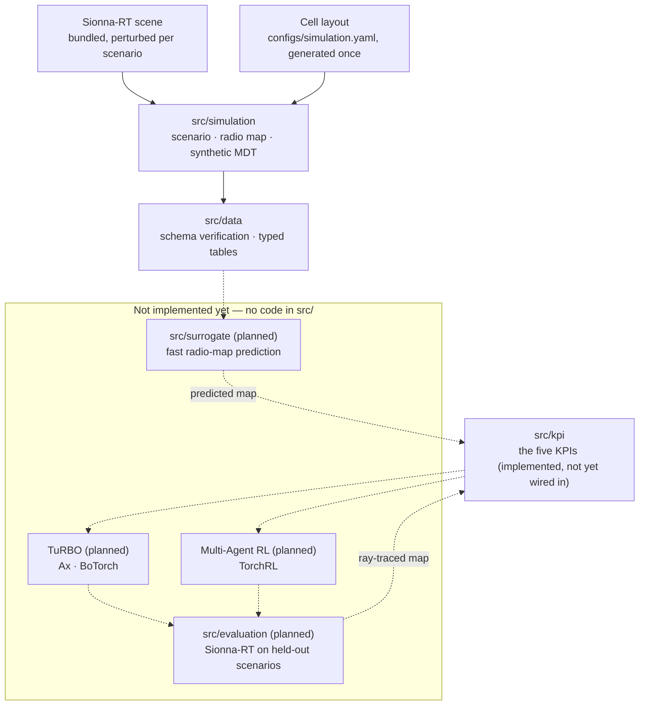

# MULTI-BAND TILT COORDINATION FOR COVERAGE EFFICIENT 5G/6G RAN

Research code comparing trust-region Bayesian Optimization (TuRBO) and
Multi-Agent Reinforcement Learning for multi-band antenna tilt coordination in
5G/6G radio access networks.

[](LICENSE)
[](pyproject.toml)
[](#status-and-ownership)

## Status and ownership

| | |
|---|---|
| **Maturity** | **Alpha** — the simulation and preprocessing pipeline runs end to end for one scenario; the optimization side (surrogate, TuRBO, MARL, held-out validation) has no code yet. |
| **Owner** | Nguyễn Duy Vũ |
| **Contact** | via [GitHub issues](https://github.com/NguyenVu04/band-tilt/issues) |
| **Source of record** | <https://github.com/NguyenVu04/band-tilt> |
| **Issue tracker** | <https://github.com/NguyenVu04/band-tilt/issues> |
| **Description of record** | this README, plus [CLAUDE.md](CLAUDE.md) |
| **Decisions** | [docs/adr/](docs/adr/) |

> [!IMPORTANT]
> **The optimization side does not exist yet.** Everything up to and including
> the five KPIs is implemented and runs; nothing past it does:
>
> 1. **The cell configuration is fully synthetic, and that is resolved.** An
>    earlier version of this project waited on a real multi-band operator
>    export. That export is retired (see
>    [Compliance and data handling](#compliance-and-data-handling)); the cell
>    layout, per-band tilt bounds and baseline tilts are instead generated once
>    by `task simulation:layout` and committed into
>    [`configs/simulation.yaml`](configs/simulation.yaml). Nothing in the active
>    pipeline waits on external data any more.
> 2. **Only one scenario is on disk.** The intended split is between whole
>    scenarios (`scenario_id`), and that needs several seeds' worth of
>    `task simulation` runs. Until then there is no honest train/validation/test
>    split — see `01_eda.ipynb` section 11.
> 3. **The surrogate, TuRBO, MARL and held-out validation phases have no code.**
>    `src/kpi/` implements the five KPIs and is unit-tested, but nothing in the
>    active pipeline calls it yet — there is no `src/surrogate/`, `src/optim/` or
>    `src/evaluation/` package to consume it. `configs/bo.yaml` exists ahead of
>    the code that would read it. See [Implementation status](#implementation-status).
>
> This is not an operated service and has no on-call rotation.

## Contents

- [Overview](#overview)
- [Architecture](#architecture)
- [Getting started](#getting-started)
- [Configuration](#configuration)
- [Usage](#usage)
- [Development](#development)
- [Testing](#testing)
- [Compliance and data handling](#compliance-and-data-handling)
- [Versioning and reproducibility](#versioning-and-reproducibility)
- [Governance](#governance)
- [Roadmap](#roadmap)

## Overview

Antenna downtilt is the cheapest lever a mobile operator has for shaping
coverage, and it is largely set by hand. Tilt a cell down and its footprint
shrinks: interference with neighbours falls, and coverage holes open at the cell
edge. Tilt it up and the reverse happens. With several frequency bands per node
the problem compounds — bands have different propagation characteristics, so they
should not cover the same footprint, and deciding which band should dominate
where is a coordination problem across dozens of coupled variables.

This project formulates that as a constrained optimization over **absolute tilt**
for every `(cell, band)` pair, evaluated against five KPIs computed from
Sionna-RT ray-traced radio maps, and compares two solution methods — **TuRBO**
(trust-region Bayesian Optimization) and **Multi-Agent RL** — under one identical
problem definition.

Everything is simulated end to end. `src/simulation/` perturbs a Sionna-RT scene
(buildings removed, resized, nudged — modelling survey error), draws a
time-varying UE population over it, ray-traces one clean radio map per band, and
samples that map at the UEs with receiver noise and realistic censoring to
produce the synthetic MDT. Because a scenario is defined by its seed and is
therefore *regenerated*, not recorded, it can also be perturbed on purpose —
which is how the project will ask whether an optimized configuration survives
conditions it was not tuned for, once the optimization side exists.

The KPI mathematics is stated in [`configs/kpi.yaml`](configs/kpi.yaml) and
implemented in [`src/kpi/`](src/kpi/); the reasoning is in
[docs/adr/](docs/adr/).

### Capabilities

- **A single, testable objective.** Five KPIs — hole rate, overlap rate, mean
  overlap neighbours, a UE-weighted band priority score, and weak rate — defined
  once in `src/kpi/`, in that lexicographic priority order. They consume a plain
  RSRP array, so the whole objective is testable against hand-computed fixtures
  with no simulator involved.
- **A shared search space.** TuRBO and MARL derive their bounds from the same
  module and score through the same functions, so the comparison measures the two
  methods rather than two implementations. TuRBO's trust region is a subset of
  that space, never a relaxation of it.
- **A radio-map surrogate (planned).** Ray tracing is too slow to sit inside a
  training loop, so a learned model is meant to predict the RSRP map during
  search, with `src/kpi/` deriving the KPIs from its output — the same code that
  scores a ray-traced map. Not built yet; see
  [Implementation status](#implementation-status).
- **Scenario-level evaluation (blocked on more scenarios).** Train, validation
  and test are meant to split between whole scenarios, so the held-out numbers
  measure transfer to unseen environments rather than interpolation within one.
  Only one scenario is on disk today, so this split cannot be made yet.
- **Band-generic throughout.** Nothing hardcodes the number of bands. Adding one
  is an edit to `configs/simulation.yaml`'s `radio_map.bands` and
  `transmitters.cells[*].tilt`.

### Non-goals

- **Minimising reconfiguration effort.** `delta_tilt` is derived after
  optimization for reporting only; there is no penalty on how far an antenna
  moves. The research question is which configuration is best, not how to get
  there cheaply.
- **Accessibility, throughput, and interference KPIs.** Excluded from the
  formulation. The available data supports neither — MDT carries RSRP and
  position, not connection outcomes, and modelling throughput would need load and
  scheduler assumptions that would dominate the result
  ([ADR 0001](docs/adr/0001-five-kpis-under-lexicographic-priority.md)).
- **Validation against a live network.** Robustness is studied by perturbing
  simulated scenarios, not by comparing against measurements from a real network.
  Every number this project produces comes from simulation, and no part of the
  chain is calibrated against reality.
- **Deployment to a live network.** There is no OSS/northbound integration and
  none is planned. The output is a tilt table, not a configuration push.

## Architecture



Solid arrows are implemented and run today; dashed arrows are the intended
design, not yet built. The KPI module is meant to sit downstream of *both* the
simulator and the surrogate once the surrogate exists, so a predicted score and
a ground-truth score stay comparable — but nothing calls `src/kpi/` from the
pipeline yet.

### Components

| Component | Responsibility | Location |
|---|---|---|
| Core | The `Cell` / per-band `Tilt` data model shared by every other module | [`src/core/`](src/core/) |
| Simulation | Scene perturbation, UE population, radio-map ray tracing, synthetic MDT | [`src/simulation/`](src/simulation/) |
| Data | Load the simulation output, verify it against its contract, write typed processed tables | [`src/data/`](src/data/) |
| KPI | The five KPIs and their lexicographic priority — implemented and tested, not yet called from the pipeline | [`src/kpi/`](src/kpi/) |
| Utils | Config loading, seeding, plotting helpers shared by every notebook | [`src/utils/`](src/utils/) |
| Surrogate *(planned)* | Fast radio-map prediction so search does not need ray tracing | not started |
| Optimization *(planned)* | The shared search space and objective, plus TuRBO and MARL | not started |
| Evaluation *(planned)* | Sionna-RT validation on held-out scenarios, method comparison, reporting | not started |
| Notebooks | The pipeline, one notebook per phase | [`notebooks/`](notebooks/) |
| Configuration | Every tunable, in Hydra groups | [`configs/`](configs/) |

`app/` (FastAPI + Streamlit serving) is unrelated template scaffolding left over
from the project's starting point — see
[Implementation status](#implementation-status).

### External dependencies

| Dependency | Purpose | Criticality | Notes |
|---|---|---|---|
| [Sionna-RT](https://nvlabs.github.io/sionna/) | The bundled scene, and ray-traced radio maps every downstream artifact derives from | **Critical** | `--extra rt`; needs a CUDA GPU to be practical |
| Cell layout and tilt bounds | Band, carrier, power and per-band tilt bounds per cell | Resolved | Generated once by `task simulation:layout` and committed in [`configs/simulation.yaml`](configs/simulation.yaml) — no external data needed |
| [Ax](https://ax.dev/) + [BoTorch](https://botorch.org/) | The GP model and acquisition TuRBO would be built on | Not yet used | `--extra bo`; no `src/optim/` package reads it yet |
| [TorchRL](https://pytorch.org/rl/) | The MARL environment, policy and trainer | Not yet used | `--extra marl`; no `src/optim/` package reads it yet |
| [DVC](https://dvc.org/) | Data and artifact versioning | Optional | `--extra dvc`; see [`dvc.yaml`](dvc.yaml). **Not yet initialised in this repository** — there is no `.dvc/` directory or remote configured; `data/` is presently just gitignored |
| [MLflow](https://mlflow.org/) | Experiment tracking | Optional | `--extra tracking`; imported lazily; not yet called from the active pipeline |

## Getting started

### Prerequisites

| Requirement | Version | Notes |
|---|---|---|
| Python | `>=3.11,<3.14` | capped: hydra-core 1.3.x cannot build its argparse parser on 3.14 |
| [uv](https://docs.astral.sh/uv/) | 0.9+ | the only supported installer; `uv.lock` is committed |
| [Task](https://taskfile.dev/) | 3.x | the task runner; every command below assumes it |
| CUDA GPU | — | needed for `task simulation:radio` and `task simulation:mdt`; Sionna-RT ray tracing is impractically slow without one |
| Sionna-RT scene | — | bundled with the `rt` extra (`task sync:rt`); nothing supplied externally |

### Install

```bash
git clone https://github.com/NguyenVu04/band-tilt.git
cd band-tilt
task setup
```

`task setup` installs every extra and the pre-commit hooks. For data work alone,
`task sync` installs the base and dev environment without Sionna-RT, Ax/BoTorch
or TorchRL — a much smaller download.

### Configure

```bash
cp .env.example .env
# Fill in the required values — see Configuration below.
```

`.env` holds only environment-specific settings. Anything that affects a result
lives in `configs/`, so that Git history records what produced it.

### Verify

```bash
task check
```

Expected output:

```
uv run ruff check .
All checks passed!
uv run ruff format --check .
uv run pytest
38 passed
```

`tests/` covers `src/simulation/`'s density, region and traffic logic — the
parts most worth pinning down by hand-computed fixtures. It does not yet cover
`src/data/`, `src/kpi/` or `src/core/`; see
[Implementation status](#implementation-status).

To confirm the active package tree is intact:

```bash
uv run python -c "import src.simulation, src.data, src.kpi, src.core, src.utils"
```

This must succeed silently.

## Configuration

Results-affecting settings live in [`configs/`](configs/) as Hydra groups,
composed by `src.config.load_config` into one `cfg` with `cfg.simulation`,
`cfg.kpi` and `cfg.data`, per [`configs/config.yaml`](configs/config.yaml)'s
`defaults` list.

| Group | File | Holds |
|---|---|---|
| `simulation` | [`configs/simulation.yaml`](configs/simulation.yaml) | scene, grid, UE population, perturbation, materials, the cell layout and tilt bounds, radio-map solver settings, MDT noise/censoring, output paths |
| `kpi` | [`configs/kpi.yaml`](configs/kpi.yaml) | KPI thresholds, priority order, Band Priority Score weights |
| `data` | [`configs/data.yaml`](configs/data.yaml) | output paths for the two processed tables |

[`configs/bo.yaml`](configs/bo.yaml) exists but is not in the `defaults` list
and nothing reads it yet — it was written ahead of `src/optim/`.

Override from the command line, e.g. `task simulation:radio -- seed=7`.

Environment variables, from `.env.example`:

| Name | Type | Default | Required | Secret | Description |
|---|---|---|---|---|---|
| `MLFLOW_TRACKING_URI` | string | `./mlruns` | no | no | Where experiment runs are recorded |
| `DVC_REMOTE_URL` | string | — | no | **yes** | Remote for `dvc push` / `dvc pull`; may embed credentials |
| `DATA_ROOT` | string | `./data` | no | no | Override when the dataset lives outside the repository |

Precedence: command-line Hydra overrides > environment variables > `configs/`
defaults.

`.env` is gitignored and there is no secret manager — this is a research
repository, and `DVC_REMOTE_URL` is the only value that may carry a credential.

## Usage

The implemented part of the pipeline runs as three notebooks, or as scripts
through the task runner and `dvc repro`. Both call the same functions in
`src/`, so they cannot diverge.

| Phase | Notebook | Script |
|---|---|---|
| 1 — Generate the scenario, radio maps and synthetic MDT | [`00_simulation`](notebooks/00_simulation.ipynb) | `task simulation` (`simulation:scenario` → `simulation:radio` → `simulation:mdt`) |
| 2 — Explore the simulation output; specify notebook 02 | [`01_eda`](notebooks/01_eda.ipynb) | — (read-only, writes no artifacts) |
| 3 — Verify and type the processed tables | [`02_preprocessing`](notebooks/02_preprocessing.ipynb) | `python -m src.data.build` |

```bash
task lab                # start JupyterLab
task simulation         # the three simulation stages, in order
task dvc:repro          # the same pipeline through DVC, skipping what's unchanged
```

**Nothing past preprocessing runs today.** `notebooks/03a_model_a.ipynb` and
`notebooks/04_evaluation.ipynb` are unadapted generic ML-project template
notebooks — they still reference `src/models/`, `src/data/split` and
`src/evaluation/metrics`, none of which exist in this project — left over from
the project's starting point and not yet rewritten for this problem. `task
clean:data` also still exists but calls `src.data.clean`, which does not exist
either; see [Implementation status](#implementation-status).

Each of the three real notebooks opens in Colab from the badge in its first
cell; the bootstrap cell clones the repository and installs what Colab does not
ship.

Once the optimization side exists, the deliverable will be the tilt table —
`current_tilt`, `optimized_tilt` and the derived `delta_tilt` for every
cell-band — plus the baseline/TuRBO/MARL comparison across all five KPIs.

## Development

### Layout

```
band-tilt/
├── configs/       Hydra config groups — every tunable
├── data/          gitignored; scenario, radio map and MDT artifacts (DVC not yet initialised — see External dependencies)
├── docs/adr/      architecture decision records
├── notebooks/     00-02 are the real pipeline; 03a/04 are unadapted template stubs
├── src/           importable project logic
├── tests/         unit tests for src/simulation/'s density, region and traffic logic
├── app/           template serving scaffolding — see Implementation status
└── Taskfile.yml   every command
```

### Implementation status

| Area | State |
|---|---|
| `src/core/` — the `Cell` / `Tilt` data model | Implemented |
| `src/simulation/` — scenario, scene, perturbation, materials, transmitters, radio map, MDT | Implemented; runs end to end for one scenario (`task simulation`) |
| `src/data/` — load, schema verification, processed-table build | Implemented (`python -m src.data.build`) |
| `src/kpi/` — the five KPIs (`hole`, `overlap`, `mean_overlap_neighbors`, `bps`, `weak`) and `serving.py` | Implemented, unit-tested, **not yet called from the pipeline** — no notebook or `src/data/build.py` step computes a KPI |
| `src/utils/` — config loading, seeding, plotting | Implemented |
| `notebooks/00_simulation.ipynb`, `01_eda.ipynb`, `02_preprocessing.ipynb` | Written and adapted to this project |
| `notebooks/03a_model_a.ipynb`, `04_evaluation.ipynb` | Unadapted generic ML-project template notebooks; reference `src/models/`, `src/data/split`, `src/evaluation/` — none of which exist here |
| `src/surrogate/`, `src/optim/`, `src/evaluation/` | Do not exist. `configs/bo.yaml` was written ahead of `src/optim/` and nothing reads it |
| `app/` (FastAPI + Streamlit) | Untouched template scaffolding. Out of scope; `app/api/dependencies.py` still refers to `cfg.models.artifact_path`, which does not compose against `configs/config.yaml` |
| CI | None. `task lint` and `task test` run locally only. |

#### Known gaps in the active pipeline

| Gap | Consequence |
|---|---|
| Only one scenario is on disk | The intended between-scenario train/validation/test split cannot be made yet — see `01_eda.ipynb` section 11 |
| `src/kpi/` is not wired into `src/data/build.py` or any notebook | The five KPIs can be unit-tested but not yet computed against a real scenario's radio map |
| `task clean:data` calls `src.data.clean`, which does not exist | The task is dead; the legacy operator-export cleaning it used to run is retired, see [Compliance and data handling](#compliance-and-data-handling) |
| `notebooks/03a_model_a.ipynb`, `04_evaluation.ipynb` | Not yet rewritten for this project's data and objective |

### Standards

| | |
|---|---|
| **Style and lint** | `ruff` with `E`, `F`, `I`, `UP`, `B`, `D` (Google docstrings), enforced by pre-commit and `task lint` |
| **Commits** | [Conventional Commits](https://www.conventionalcommits.org/) |
| **Branching** | short-lived branches off `main` |
| **Review** | self-review before merge — see [Governance](#governance) |

### Local loop

```bash
task format
task check
```

## Testing

| Tier | Scope | Command | Where it runs |
|---|---|---|---|
| Unit | `src/simulation/`'s density, region and traffic logic, against synthetic fixtures | `task test` | pre-commit, locally |
| Single test | One behaviour | `uv run pytest tests/test_density.py -k <name>` | locally |

**There is no coverage gate and no CI.** `tests/` currently covers only
`src/simulation/density.py`, `sample.py` (region) and `traffic.py` — 38 tests,
all passing, none skipped. `src/data/`, `src/kpi/` and `src/core/` have no
tests yet.

The one rule the tests hold to: **no test touches Sionna-RT, a GPU, or a real
dataset.** Fixtures are tiny and synthetic, so `task test` runs the same way in
CI as on a laptop with no GPU — once CI exists.

## Compliance and data handling

**MDT is synthetic.** Both the UE positions and their RSRP are generated by
`src/simulation/` — the UE population from a time-varying density model over the
scene, the RSRP by Sionna-RT ray tracing against that same scene. No `ue_id`
corresponds to a person, no position was observed, and nothing in the pipeline
is personal data. There is no DPIA to write and no lawful basis to establish,
because there is no data subject.

| | |
|---|---|
| **Data categories** | Simulated UE position in the scene's local frame, simulation timestamp, tile index, cell-band, simulated RSRP |
| **Provenance** | Generated from a bundled Sionna-RT scene, a synthetic UE-density model and per-cell tilt configuration. Regenerable from the scenario manifest (`data/external/scenario.json`) and the seed. |
| **Personal data** | None |
| **Retention** | Governed by storage cost, not by law. Meant to live in DVC for the life of the project; DVC is not yet initialised, so today the only copy is each contributor's local `data/`. |
| **Residency** | Wherever the DVC remote ends up configured; none exists yet. |

### The retired operator export

An earlier formulation used a real MDT export — 41,481 measurements from 1,490
devices over roughly two weeks. That file **did** contain device-level location
traces: a pseudonymous identifier, coordinates and a timestamp per measurement,
and sequences of those points describe where a device went and when. Trajectory
data is notoriously re-identifiable, so it was personal data under most regimes
despite carrying no name, MSISDN or IMSI.

It is no longer an input to this project — `data/` in this repository carries no
`raw/` directory and `dvc.yaml` no longer defines a stage that reads one. There
is also no DVC remote configured in this repository (see
[External dependencies](#external-dependencies)), so there is nowhere here a
copy of `measurement_data.csv` could persist; if one exists it is on someone's
disk or in a remote from before this formulation, not tracked by anything here.

> [!WARNING]
> **Do not reintroduce the operator export as a project input** without first
> settling what the earlier version of this section called for and never
> obtained: the lawful basis for research use, whether the pseudonymisation is
> sufficient given the trajectory structure, a retention period, and whether raw
> coordinates may appear in published figures. None of that was ever assessed.
> Deleting it from the DVC remote is the cleaner option if nothing depends on it.

The repository never commits data: `data/` is gitignored (meant to become
DVC-tracked once DVC is initialised), `.env` is gitignored, and no identifier
appears in any committed file.

## Versioning and reproducibility

This project follows [Semantic Versioning](https://semver.org/spec/v2.0.0.html).

**The public API is** the `src/` module and function signatures, and the
`configs/` schema. Everything else — notebook internals, `app/`, the contents of
`reports/` — may change in any release. While the project is Alpha, signatures
change without a major version bump; the ADRs record the changes that matter.

### Artifact lineage

Code alone does not reproduce a result that depends on data, on a random seed,
and on a ray-tracing configuration.

| Layer | Versioned by | Answers |
|---|---|---|
| Code and configuration | Git, plus the Hydra config saved beside each run in `outputs/` | By what procedure was this produced? |
| Data and artifacts | DVC (`.dvc` files committed, contents in the remote) — **not yet set up**; `task dvc:init` has not been run in this repository | Which exact inputs and outputs? |
| Runs and results | MLflow (`./mlruns` by default) | What happened, and how did it score? |
| Simulation fidelity | `cfg.simulation.radio_map` and `cfg.simulation.grid`, recorded in the radio map's own `.npz` metadata | Against what ground truth? |
| Scenario | `scenario_id` and its manifest (`data/external/scenario.json`) — scene perturbation, density, time schedule, seed | Which world was this measured in? |

Restore a past result today: check out the commit, then `task dvc:repro` to
regenerate `data/` locally (there is no remote yet to `dvc pull` from).

Three things invalidate stored results rather than adding to them, because they
change the ground truth itself: the ray-tracing settings, the grid resolution,
and the KPI thresholds or their order. `dvc.yaml` expresses the first two as
parameter dependencies on the `simulation_radio` stage so a change forces a
rebuild; the third needs an ADR (see [ADR 0001](docs/adr/0001-five-kpis-under-lexicographic-priority.md)
for the existing one).

Artifact retention follows the DVC remote's policy; none is configured yet.

## Governance

| | |
|---|---|
| **Maintainer** | Nguyễn Duy Vũ — sole maintainer; there is no `CODEOWNERS` file |
| **Review requirement** | Self-review before merge; one approval once there is a second contributor |
| **Merge policy** | Squash onto `main`, linear history, `task check` green |
| **Decision records** | [`docs/adr/`](docs/adr/) |

Architecturally significant changes need an ADR **before** implementation. A
change to the KPI definitions, the decision variable, the angle convention, the
split scheme, or what a reported result may be computed from is always
significant — see [docs/adr/README.md](docs/adr/README.md).

## Roadmap

Ordered roughly by what unblocks the most.

| Item | Blocked on | Status |
|---|---|---|
| Run `task dvc:init` and configure a remote | — | Not started; `data/` is presently gitignored only |
| Run `task simulation` for several seeds, so a between-scenario split exists | — | **Blocking most of the below** |
| Wire `src/kpi/` into `src/data/build.py` or a new notebook, computing the five KPIs against the baseline radio map | — | Not started; the KPI module itself is done |
| Implement scenario-level train/validation/test splitting | multiple scenarios (above) | Not started |
| Rewrite `notebooks/03a_model_a.ipynb` / `04_evaluation.ipynb` for this project, or delete them | the split (above) | Not started |
| Delete or replace the dead `task clean:data` (`src.data.clean` does not exist) | — | Not started |
| Design and implement `src/surrogate/` — radio-map prediction from features, trained against the ray-traced maps | the split (above) | Not started |
| Implement `src/optim/bo/` (TuRBO) against `configs/bo.yaml`, which already exists | a surrogate that passes acceptance | Not started |
| Implement `src/optim/marl/` (Multi-Agent RL) over the same search space | a surrogate that passes acceptance | Not started |
| Implement `src/evaluation/` — re-evaluate optimized tilts with Sionna-RT on held-out scenarios, compare methods | TuRBO and MARL results | Not started |
| Decide the fate of `app/` (finish it as a serving layer, or remove the template scaffolding) | — | Not started |
| CI (`task check` on every push) | — | Not started |

## License

MIT — see [LICENSE](LICENSE).
